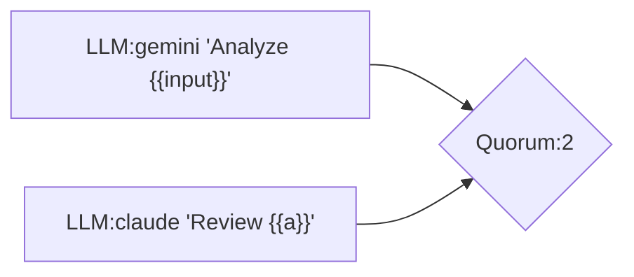
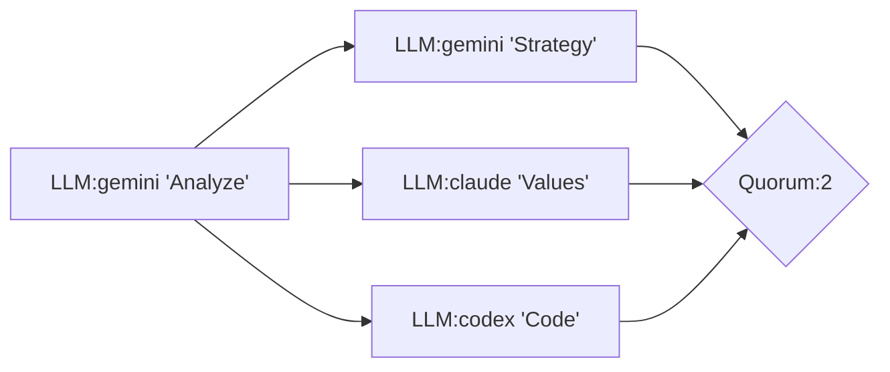
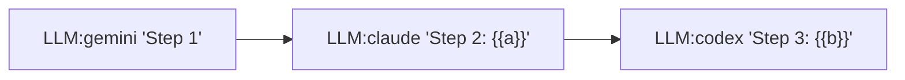
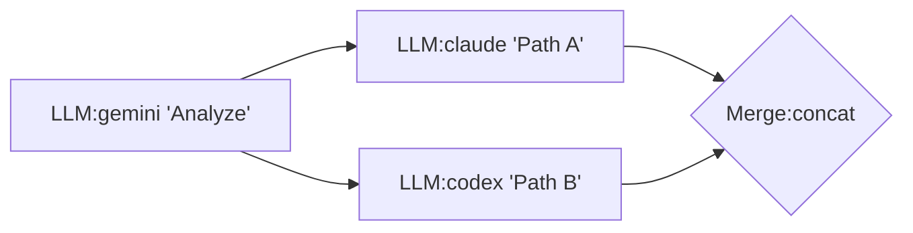
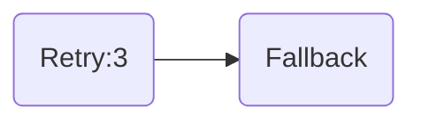
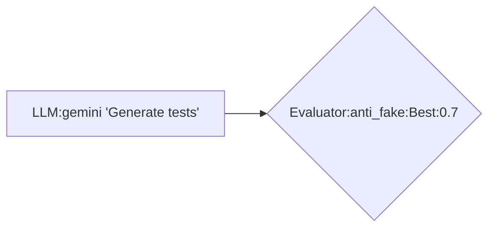

# LLM-MCP Chain Engine Instructions

## Quick Reference

### Available Tools
```
chain.run          - Execute a chain (JSON or Mermaid)
chain.validate     - Validate chain syntax
chain.to_mermaid   - Convert JSON chain to Mermaid
chain.list         - List registered chains
chain.orchestrate  - Run preset chain by ID
```

### Presets (data/chains/)
| ID | Description |
|----|-------------|
| magi-code-review | 3-LLM consensus code review |
| deep-research | Multi-source research + fact-check |
| pr-review-pipeline | Automated PR review |
| incident-response | Incident triage |
| code-migration | Code transform + verify |

---

## Chain DSL Syntax

### Mermaid Format (Recommended)


### Node Type Syntax in Mermaid

| Node Type | Mermaid Syntax | Shape |
|-----------|----------------|-------|
| LLM | `["LLM:model 'prompt'"]` | `[rect]` |
| Tool | `["Tool:name {...}"]` | `[rect]` |
| Quorum | `{Quorum:N}` | `{diamond}` |
| Gate | `{Gate:condition}` | `{diamond}` |
| Merge | `{Merge:strategy}` | `{diamond}` |
| Threshold | `{Threshold:>=0.8}` | `{diamond}` |
| Pipeline | `[["Pipeline"]]` | `[[double]]` |
| Fanout | `[["Fanout"]]` | `[[double]]` |
| ChainRef | `[["ChainRef:id"]]` | `[[double]]` |
| Retry | `("Retry:3")` | `(rounded)` |
| Fallback | `("Fallback")` | `(rounded)` |
| Race | `("Race")` | `(rounded)` |
| Adapter | `>/"Adapter:Extract .data"/` | `>/trap/` |
| Cache | `[["Cache:60s"]]` | `[[double]]` |
| GoalDriven | `{GoalDriven:evaluator}` | `{diamond}` |
| Spawn | `[["Spawn:clean,node"]]` | `[[double]]` |

### LLM Node Format
```
["LLM:model 'prompt with {{variable}}'"]
```
- Models: `gemini`, `claude`, `codex`, `ollama:model-name`
- Variables: `{{input}}`, `{{node_id}}`, `{{node_id.field}}`

### Quorum Node
```
{Quorum:N}
```
- N = required successes (e.g., `{Quorum:2}` = 2 out of inputs must succeed)

### Gate (Conditional)
```
{Gate:condition ? then_node : else_node}
```
- Simple: `{Gate:{{score}} > 0.8}`

### Edges (Dependencies)
```
a --> b           // b depends on a
a --> b --> c     // sequential
a --> c           // parallel with b --> c
b --> c
```

---

## JSON Format

```json
{
  "id": "my-chain",
  "nodes": [
    {
      "id": "analyze",
      "type": "llm",
      "model": "gemini",
      "prompt": "Analyze: {{input}}"
    },
    {
      "id": "review",
      "type": "llm",
      "model": "claude",
      "prompt": "Review: {{analyze}}",
      "input_mapping": [["data", "analyze"]]
    },
    {
      "id": "final",
      "type": "quorum",
      "required": 2,
      "inputs": ["analyze", "review"],
      "input_mapping": [["a", "analyze"], ["b", "review"]]
    }
  ],
  "output": "final"
}
```

### Key Fields
- `id`: Unique node identifier
- `type`: Node type (llm, tool, quorum, gate, etc.)
- `input_mapping`: `[["param_name", "source_node_id"], ...]`
- `output`: Final output node ID

---

## Common Patterns

### 1. MAGI (3-LLM Consensus)


### 2. Pipeline (Sequential)


### 3. Diamond (Fan-out/Fan-in)


### 4. Retry with Fallback


---

## Evaluator Node (Quality Gates)

The Evaluator node scores candidates and selects the best one.

### Scoring Functions

| Function | Description | Use Case |
|----------|-------------|----------|
| `llm_judge` | LLM scores 0.0-1.0 | General quality assessment |
| `regex_match` | Pattern matching | Structured output validation |
| `json_schema` | JSON structure depth | API response validation |
| `anti_fake` | **Hybrid heuristic+LLM** | **Test/code quality gates** |
| `custom` | Extract from output | Domain-specific scoring |

### Anti-Fake Scoring (Built-in)

Detects fake tests and low-quality code using hybrid analysis:

```
┌─────────────────────────────────────────────────────────────┐
│                    anti_fake scoring                        │
├─────────────────────────────────────────────────────────────┤
│  Phase 1: Heuristics (50%)                                  │
│    - Penalty: "assert true", "let _ =", "(* TODO"           │
│    - Bonus: real assertions, roundtrip patterns             │
├─────────────────────────────────────────────────────────────┤
│  Phase 2: LLM Judge (50%)                                   │
│    - Semantic analysis of test quality                      │
│    - Detects missing edge cases, fake coverage              │
└─────────────────────────────────────────────────────────────┘
```

### Example: Anti-Fake Gate



This chain:
1. Generates test code
2. Scores with anti_fake (heuristic + LLM)
3. Fails if score < 0.7

---

## Dashboard

- **URL**: `http://localhost:8932/dashboard`
- **SSE Events**: `/chain/events`
- **Live Visualization**: Nodes change color as they execute
  - Gray: Pending
  - Yellow: Running
  - Green: Complete
  - Red: Error

---

## API Endpoints

| Endpoint | Method | Description |
|----------|--------|-------------|
| `/mcp` | POST | JSON-RPC requests |
| `/mcp` | GET | SSE notification stream |
| `/dashboard` | GET | Live visualization |
| `/chain/events` | GET | Chain execution SSE |
| `/health` | GET | Server health |

---

## Examples

### Run MAGI Code Review
```bash
curl -X POST http://localhost:8932/mcp -H "Content-Type: application/json" -d '{
  "jsonrpc": "2.0",
  "id": 1,
  "method": "tools/call",
  "params": {
    "name": "chain.orchestrate",
    "arguments": {
      "chain_id": "magi-code-review",
      "input": {"file_path": "src/main.ts"}
    }
  }
}'
```

### Validate Mermaid Chain
```bash
curl -X POST http://localhost:8932/mcp -H "Content-Type: application/json" -d '{
  "jsonrpc": "2.0",
  "id": 1,
  "method": "tools/call",
  "params": {
    "name": "chain.validate",
    "arguments": {
      "mermaid": "graph LR\n    a[\"LLM:gemini '\''test'\''\"]\n    b[\"LLM:claude '\''review'\''\"]"
    }
  }
}'
```
