# LLM-MCP Chain Engine Instructions

## Quick Reference

### Available Tools
```
chain.run          - Execute a chain (JSON or Mermaid)
chain.validate     - Validate chain syntax
chain.to_mermaid   - Convert JSON chain to Mermaid
chain.list         - List registered chains
chain.orchestrate  - Run preset chain by ID
chain.checkpoints  - List saved checkpoints
chain.resume       - Resume chain from checkpoint

prompt.register    - Register a prompt template
prompt.list        - List all registered prompts
prompt.get         - Get prompt by ID (with optional version)
```

### Presets (data/chains/) — 주요 프리셋
| ID | Description | When to Use |
|----|-------------|-------------|
| consensus-review | 3-LLM consensus code review | 중요한 코드 변경 리뷰 |
| mcts-mantra-review | MCTS + MANTRA refactoring | 리팩토링 품질 보장 |
| deep-research | Multi-source research + fact-check | 깊은 리서치 필요 시 |
| pr-review-pipeline | Automated PR review | CI 통합 자동 리뷰 |
| incident-response | Incident triage | 장애 초기 대응 |
| code-migration | Code transform + verify | 대규모 코드 이전 |
| figma-to-web-component-v2 | FeedbackLoop SSIM 0.95+ | 디자인 → 코드 변환 (반복 개선) |
| cascade-default | GLM → Gemini → Claude | 비용 최적화 cascade |
| coverage-generator | LLM + anti_fake quality gate | 테스트 커버리지 생성 |

전체 27개 프리셋 목록: `chain.list` 또는 README.md 참고.

> 📖 **Full Guide**: [docs/PRESETS.md](docs/PRESETS.md) - Mermaid 다이어그램 + 사용 예시

---

## Chain DSL Syntax

### Mermaid Format (Recommended)


### Node Type Syntax in Mermaid

| Node Type | Mermaid Syntax | Shape |
|-----------|----------------|-------|
| LLM | `["LLM:model 'prompt'"]` | `[rect]` |
| Tool | `["Tool:name {...}"]` | `[rect]` |
| Quorum | `{Quorum:N}` | `{diamond}` |
| Gate | `{Gate:condition}` | `{diamond}` |
| Merge | `{Merge:strategy}` | `{diamond}` |
| Threshold | `{Threshold:>=0.8}` | `{diamond}` |
| MCTS | `{MCTS:policy:iterations}` | `{diamond}` |
| Evaluator | `{Evaluator:func:strategy:min_score}` | `{diamond}` |
| Pipeline | `[["Pipeline"]]` | `[[double]]` |
| Fanout | `[["Fanout"]]` | `[[double]]` |
| ChainRef | `[["ChainRef:id"]]` | `[[double]]` |
| Map | `[[Map:func,node_id]]` | `[[double]]` |
| Bind | `[[Bind:func,node_id]]` | `[[double]]` |
| Batch | `[[Batch:size,parallel,node_id]]` | `[[double]]` |
| StreamMerge | `[[StreamMerge:reducer,min,timeout]]` | `[[double]]` |
| Retry | `("Retry:3")` | `(rounded)` |
| Fallback | `("Fallback")` | `(rounded)` |
| Race | `("Race")` | `(rounded)` |
| Cascade | `("Cascade:0.7:summary")` | `(rounded)` |
| Adapter | `>/"Adapter:Extract .data"/` | `>/trap/` |
| Cache | `[["Cache:key_expr,ttl,node_id"]]` | `[[double]]` |
| GoalDriven | `{GoalDriven:metric:op:value:max_iter}` | `{diamond}` |
| Spawn | `[["Spawn:clean,node"]]` | `[[double]]` |
| FeedbackLoop | `[[FeedbackLoop:scoring_func,max_iter,>=threshold]]` | `[[double]]` |
| Masc_broadcast | `((📢 MASC:broadcast))` | `((circle))` |
| Masc_listen | `((👂 MASC:listen))` | `((circle))` |
| Masc_claim | `((✋ MASC:claim))` | `((circle))` |

### LLM Node Format
```
["LLM:model 'prompt with {{variable}}'"]
```
- **Concrete models**: `gemini`, `claude`, `codex`, `ollama:model-name`
- **Category aliases** (auto-resolves to best available):
  | Category | Resolves to | Use case |
  |----------|-------------|----------|
  | `reasoning` | Falcon-H1R, DeepSeek-R1 | Complex reasoning, math |
  | `coding` | qwen3-coder:30b | Code generation, review |
  | `general` | qwen3:1.7b | General tasks |
  | `multimodal` | gemini | Vision, multi-modal |
- Variables: `{{input}}`, `{{node_id}}`, `{{node_id.field}}`

### Quorum Node
```
{Quorum:N}
```
- N = required successes (e.g., `{Quorum:2}` = 2 out of inputs must succeed)

### Gate (Conditional)
```
{Gate:condition ? then_node : else_node}
```
- Simple: `{Gate:{{score}} > 0.8}`

### Edges (Dependencies)
```
a --> b           // b depends on a
a --> b --> c     // sequential
a --> c           // parallel with b --> c
b --> c
```

---

## JSON Format

```json
{
  "id": "my-chain",
  "nodes": [
    {
      "id": "analyze",
      "type": "llm",
      "model": "gemini",
      "prompt": "Analyze: {{input}}"
    },
    {
      "id": "review",
      "type": "llm",
      "model": "claude",
      "prompt": "Review: {{analyze}}",
      "input_mapping": [["data", "analyze"]]
    },
    {
      "id": "final",
      "type": "quorum",
      "required": 2,
      "inputs": ["analyze", "review"],
      "input_mapping": [["a", "analyze"], ["b", "review"]]
    }
  ],
  "output": "final"
}
```

### Key Fields
- `id`: Unique node identifier
- `type`: Node type (llm, tool, quorum, gate, etc.)
- `input_mapping`: `[["param_name", "source_node_id"], ...]`
- `output`: Final output node ID

---

## Common Patterns

### 1. Consensus (3-LLM 합의)


### 2. Pipeline (Sequential)


### 3. Diamond (Fan-out/Fan-in)


### 4. Retry with Fallback


### 5. Cascade (Cost/Speed-Optimized LLM Routing)


Cascade differs from Fallback:
- **Fallback** = availability: next model on error/timeout
- **Cascade** = quality: next model when confidence is insufficient

Parameters: `Cascade:threshold:context_mode`
- `threshold`: confidence threshold (0.0-1.0, default 0.7)
- `context_mode`: `none`, `summary` (default, 500 chars), `full`

Each tier's LLM self-assesses confidence (`Confidence: High/Medium/Low`). If below threshold, escalates to the next tier. Preset: `cascade-default.json` (3-tier: GLM-5 -> Gemini -> Claude).

---

## Evaluator Node (Quality Gates)

The Evaluator node scores candidates and selects the best one.

### Scoring Functions

| Function | Description | Use Case |
|----------|-------------|----------|
| `llm_judge` | LLM scores 0.0-1.0 | General quality assessment |
| `regex_match` | Pattern matching | Structured output validation |
| `json_schema` | JSON structure depth | API response validation |
| `anti_fake` | **Hybrid heuristic+LLM** | **Test/code quality gates** |
| `custom` | Extract from output | Domain-specific scoring |

### Anti-Fake Scoring (Built-in)

Detects fake tests and low-quality code using hybrid analysis:

```
┌─────────────────────────────────────────────────────────────┐
│                    anti_fake scoring                        │
├─────────────────────────────────────────────────────────────┤
│  Phase 1: Heuristics (50%)                                  │
│    - Penalty: "assert true", "let _ =", "(* TODO"           │
│    - Bonus: real assertions, roundtrip patterns             │
├─────────────────────────────────────────────────────────────┤
│  Phase 2: LLM Judge (50%)                                   │
│    - Semantic analysis of test quality                      │
│    - Detects missing edge cases, fake coverage              │
└─────────────────────────────────────────────────────────────┘
```

### Example: Anti-Fake Gate


This chain:
1. Generates test code
2. Scores with anti_fake (heuristic + LLM)
3. Fails if score < 0.7

---

## FeedbackLoop (Iterative Improvement)

The FeedbackLoop node combines generation, evaluation, and improvement in an iterative cycle until quality threshold is met.

### Concept (DSPy-Inspired)

```
┌──────────────────────────────────────────────────────────┐
│                    FeedbackLoop                           │
├──────────────────────────────────────────────────────────┤
│  1. Generator → produces initial output                   │
│  2. Evaluator → scores output (0.0-1.0)                   │
│  3. If score < threshold:                                 │
│     - Generate feedback explaining why                    │
│     - Improver uses feedback to regenerate                │
│     - Loop back to step 2                                 │
│  4. Exit when score >= threshold or max_iterations hit    │
└──────────────────────────────────────────────────────────┘
```

### Mermaid Syntax


Parameters: `FeedbackLoop:scoring_func,max_iterations,>=threshold`

### JSON Format

```json
{
  "id": "quality_loop",
  "type": "feedback_loop",
  "generator": {
    "id": "gen",
    "type": "llm",
    "model": "gemini",
    "prompt": "Generate: {{input}}"
  },
  "evaluator_config": {
    "scoring_func": "llm_judge",
    "scoring_prompt": "Score code quality 0-1"
  },
  "improver_prompt": "Improve based on feedback: {{feedback}}",
  "max_iterations": 3,
  "min_score": 0.8
}
```

### Example: Self-Improving Code Generation


This chain:
1. Parses requirements
2. Generates TypeScript code
3. Evaluator checks type safety
4. If score < 0.9: improver refines code with feedback
5. Repeats until score >= 0.9 or 5 iterations

---

## MCTS Node (Monte Carlo Tree Search)

MCTS enables exploration-based decision making for complex search spaces.

### Mermaid Syntax

```
{MCTS:policy:iterations}
{MCTS:policy:param:iterations}
```

### Policy Types

| Policy | Syntax | Description |
|--------|--------|-------------|
| Greedy | `{MCTS:greedy:10}` | Always select best-scoring child |
| UCB1 | `{MCTS:ucb1:1.41:10}` | Upper Confidence Bound (param = exploration constant) |
| Epsilon-Greedy | `{MCTS:eps:0.1:10}` | Random with probability epsilon |
| Softmax | `{MCTS:softmax:1.0:10}` | Temperature-based probabilistic selection |

### Example


---

## Collection Nodes (Map, Bind, Batch, StreamMerge)

These nodes handle collection-based operations for processing multiple items.

### Map Node

Applies a transformation function to each item in a collection.

```
[[Map:func,node_id]]
```

Example:


### Bind Node

Monadic chaining - routes each item to a dynamically selected node.

```
[[Bind:func,node_id]]
```

Example:


### Batch Node

Processes items in batches with optional parallelism.

```
[[Batch:size,parallel,node_id]]
[[Batch:size,node_id]]
```

Parameters:
- `size`: Number of items per batch
- `parallel`: `true` for concurrent processing, `false` for sequential (default: false)
- `node_id`: Node to process each batch

Example:


### StreamMerge Node

Progressively merges results from multiple sources as they complete.

```
[[StreamMerge:reducer,min_results,timeout]]
[[StreamMerge:reducer,min_results]]
[[StreamMerge:reducer]]
```

Parameters:
- `reducer`: Merge strategy (`first`, `last`, `concat`, `weighted_avg`, or custom)
- `min_results`: Minimum results before returning (optional)
- `timeout`: Timeout in seconds (optional)

Example:


This returns as soon as 1 result is ready, up to 30 seconds max.

---

## MASC Coordination Nodes (Multi-Agent)

MASC nodes enable chain coordination with other agents via masc-mcp.

### Node Types

| Node | Purpose | MCP Tool |
|------|---------|----------|
| `Masc_broadcast` | Send message to all agents | `masc.masc_broadcast` |
| `Masc_listen` | Wait for messages with filter | `masc.masc_messages` |
| `Masc_claim` | Claim task from backlog | `masc.masc_claim` / `masc.masc_claim_next` |

### Environment Variables

```bash
MASC_AGENT_NAME=my-agent  # Agent name for MASC calls (default: "chain-engine")
```

### JSON Format

```json
{
  "id": "notify",
  "type": "masc_broadcast",
  "message": "Starting task: {{input.task_name}}",
  "room": "my-room",
  "mention": ["@codex", "@gemini"]
}
```

```json
{
  "id": "wait",
  "type": "masc_listen",
  "filter": "done|complete",
  "timeout_sec": 30.0,
  "room": "my-room"
}
```

```json
{
  "id": "claim",
  "type": "masc_claim",
  "task_id": null,
  "room": "my-room"
}
```

### Example: Multi-Agent Pipeline

```mermaid
graph LR
    start((📢 broadcast))
    work["LLM:gemini 'Do work'"]
    wait((👂 listen))
    finish((📢 broadcast))
    start --> work --> wait --> finish
```



This chain:
1. Broadcasts "Starting work" to other agents
2. Performs LLM work
3. Waits for "done" message from another agent (30s timeout)
4. Broadcasts completion

---

## Checkpoint/Resume (State Persistence)

Checkpoint allows long-running chains to save state and resume from failure points.

### Concept (LangGraph-Inspired)

```
Chain execution:
  Node A ✅ → Checkpoint 1 saved
  Node B ✅ → Checkpoint 2 saved
  Node C ❌ failure!

Resume:
  Load Checkpoint 2 → Skip A, B → Retry C
```

### Enabling Checkpoints

```json
{
  "name": "chain.run",
  "arguments": {
    "mermaid": "graph LR\n  a --> b --> c",
    "input": {...},
    "checkpoint_enabled": true
  }
}
```

### Checkpoint Tools

#### List Checkpoints
```bash
curl -X POST http://localhost:8932/mcp -d '{
  "method": "tools/call",
  "params": {
    "name": "chain.checkpoints",
    "arguments": {"chain_id": "my-chain"}
  }
}'
```

Response:
```json
{
  "checkpoints": [
    {
      "run_id": "abc123",
      "node_id": "step_2",
      "timestamp": 1705123456.78,
      "outputs": {"step_1": "result..."}
    }
  ]
}
```

#### Resume from Checkpoint
```bash
curl -X POST http://localhost:8932/mcp -d '{
  "method": "tools/call",
  "params": {
    "name": "chain.resume",
    "arguments": {
      "run_id": "abc123",
      "input": {"additional": "data"}
    }
  }
}'
```

### Storage Location

Checkpoints are stored in: `~/.cache/llm-mcp/checkpoints/{run_id}.json`

### Example: Resumable Pipeline


Run with checkpoint:
```json
{
  "mermaid": "...",
  "checkpoint_enabled": true
}
```

If `analyze` fails, resume from `process` checkpoint without re-fetching data.

---

## Prompt Registry (Template Management)

The Prompt Registry provides versioned prompt templates with usage metrics.

### Concept (DSPy-Inspired)

```
┌─────────────────────────────────────────────────────────┐
│                    Prompt Registry                       │
├─────────────────────────────────────────────────────────┤
│  • Version control for prompts (semver)                  │
│  • Track usage metrics (count, avg_score)                │
│  • Reference prompts by ID in chains                     │
│  • A/B testing with version selection                    │
└─────────────────────────────────────────────────────────┘
```

### Prompt Tools

#### Register a Prompt
```bash
curl -X POST http://localhost:8932/mcp -d '{
  "method": "tools/call",
  "params": {
    "name": "prompt.register",
    "arguments": {
      "id": "code-review-v2",
      "template": "Review this {{language}} code:\n{{code}}\n\nFocus on: {{aspects}}",
      "version": "2.0.0"
    }
  }
}'
```

#### List Prompts
```bash
curl -X POST http://localhost:8932/mcp -d '{
  "method": "tools/call",
  "params": {
    "name": "prompt.list",
    "arguments": {}
  }
}'
```

Response:
```json
{
  "prompts": [
    {
      "id": "code-review-v2",
      "version": "2.0.0",
      "variables": ["language", "code", "aspects"],
      "metrics": {"usage_count": 156, "avg_score": 0.85}
    }
  ]
}
```

#### Get Prompt (with version)
```bash
curl -X POST http://localhost:8932/mcp -d '{
  "method": "tools/call",
  "params": {
    "name": "prompt.get",
    "arguments": {
      "id": "code-review-v2",
      "version": "1.0.0"
    }
  }
}'
```

### Using Prompts in Chains

Reference registered prompts with `prompt_ref`:

```json
{
  "id": "review",
  "type": "llm",
  "model": "claude",
  "prompt_ref": "code-review-v2",
  "prompt_vars": {
    "language": "TypeScript",
    "code": "{{input.code}}",
    "aspects": "type safety, error handling"
  }
}
```

### Storage Location

Prompts are stored in: `data/prompts/{id}.json`

### Example: A/B Testing Prompts

```json
// Version 1.0.0 - Direct approach
{"id": "summarize", "template": "Summarize: {{text}}", "version": "1.0.0"}

// Version 2.0.0 - Chain-of-thought
{"id": "summarize", "template": "Analyze key points, then summarize: {{text}}", "version": "2.0.0"}
```

Compare metrics to determine which version performs better.

---

## Dashboard

- **URL**: `http://localhost:8932/dashboard`
- **SSE Events**: `/chain/events`
- **Live Visualization**: Nodes change color as they execute
  - Gray: Pending
  - Yellow: Running
  - Green: Complete
  - Red: Error

---

## API Endpoints

| Endpoint | Method | Description |
|----------|--------|-------------|
| `/mcp` | POST | JSON-RPC requests |
| `/mcp` | GET | SSE notification stream |
| `/dashboard` | GET | Live visualization |
| `/chain/events` | GET | Chain execution SSE |
| `/health` | GET | Server health |

---

## Examples

### Run Consensus Code Review
```bash
curl -X POST http://localhost:8932/mcp -H "Content-Type: application/json" -d '{
  "jsonrpc": "2.0",
  "id": 1,
  "method": "tools/call",
  "params": {
    "name": "chain.orchestrate",
    "arguments": {
      "chain_id": "consensus-review",
      "input": {"file_path": "src/main.ts"}
    }
  }
}'
```

### Validate Mermaid Chain
```bash
curl -X POST http://localhost:8932/mcp -H "Content-Type: application/json" -d '{
  "jsonrpc": "2.0",
  "id": 1,
  "method": "tools/call",
  "params": {
    "name": "chain.validate",
    "arguments": {
      "mermaid": "graph LR\n    a[\"LLM:gemini '\''test'\''\"]\n    b[\"LLM:claude '\''review'\''\"]"
    }
  }
}'
```
