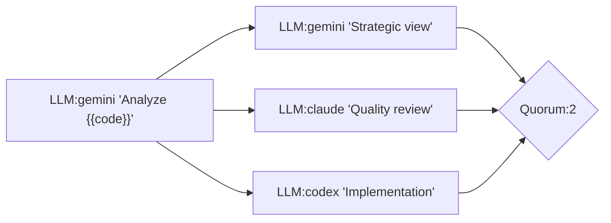
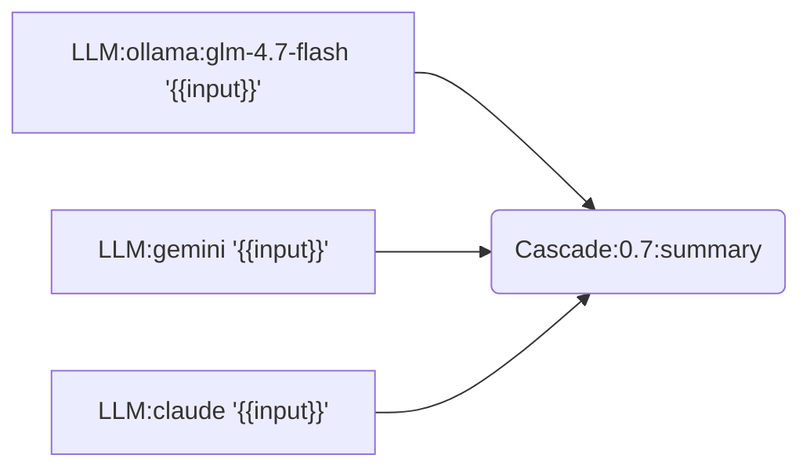

# llm-mcp

OCaml 기반 MCP 서버. 여러 LLM CLI를 MCP 도구로 호출하고, **Chain Engine**으로 복잡한 LLM 파이프라인을 구성할 수 있습니다.

> 개인 환경 기준 설계. 공개 서비스 용도로는 권장하지 않습니다.

## 주요 기능

| 기능 | 설명 |
|------|------|
| **Multi-LLM 호출** | Gemini, Claude, Codex, Ollama를 MCP 도구로 통합 |
| **Chain Engine** | Mermaid/JSON DSL로 LLM 파이프라인 정의 |
| **MAGI 패턴** | 3-LLM 합의 (Quorum) 기반 의사결정 |
| **Cascade 라우팅** | 비용/품질 최적화 - 저렴한 모델 → 고품질 모델 자동 에스컬레이션 |
| **프리셋** | 코드 리뷰, 리서치, 장애 대응 등 사전 정의된 체인 |
| **체크포인트** | 장기 실행 체인의 상태 저장/재개 |

## 아키텍처

```
┌─────────────────────────────────────────────────────────────┐
│                     llm-mcp Server                          │
├─────────────────────────────────────────────────────────────┤
│  MCP Protocol Layer (JSON-RPC 2.0 + SSE)                    │
├─────────────────────────────────────────────────────────────┤
│  ┌─────────────┐  ┌─────────────┐  ┌─────────────────────┐  │
│  │ LLM Tools   │  │ Chain Engine│  │ Prompt Registry     │  │
│  │ gemini      │  │ Mermaid DSL │  │ Version Control     │  │
│  │ claude-cli  │  │ JSON DSL    │  │ Usage Metrics       │  │
│  │ codex       │  │ Presets     │  └─────────────────────┘  │
│  │ ollama      │  │ Checkpoint  │                           │
│  └─────────────┘  └─────────────┘                           │
├─────────────────────────────────────────────────────────────┤
│  Eio Runtime (Fiber-based Concurrency)                      │
└─────────────────────────────────────────────────────────────┘
```

## 빠른 시작

```bash
opam pin add mcp_protocol https://github.com/jeong-sik/mcp-protocol-sdk.git -y
opam pin add grpc-direct https://github.com/jeong-sik/grpc-direct.git -y
opam install . --deps-only
dune build
dune exec llm-mcp -- --port 8932
```

## MCP 설정

`~/.mcp.json` 예시:

```json
{
  "mcpServers": {
    "llm-mcp": {
      "type": "http",
      "url": "http://127.0.0.1:8932/mcp"
    }
  }
}
```

stdio 모드:

```json
{
  "mcpServers": {
    "llm-mcp": {
      "command": "llm-mcp",
      "args": ["--stdio"]
    }
  }
}
```

## Chain Engine 예시

### MAGI 패턴 (3-LLM 합의)



### Cascade 라우팅 (비용 최적화)



저렴한 모델부터 시도하고, confidence < 0.7이면 다음 모델로 에스컬레이션.

### 실행

```bash
curl -X POST http://localhost:8932/mcp -H "Content-Type: application/json" -d '{
  "jsonrpc": "2.0", "id": 1,
  "method": "tools/call",
  "params": {
    "name": "chain.run",
    "arguments": {
      "mermaid": "graph LR\n  a[\"LLM:gemini '\''Hello'\''\"]",
      "input": {}
    }
  }
}'
```

## 프리셋

| ID | 용도 | 설명 |
|----|------|------|
| `magi-code-review` | 코드 리뷰 | 3-LLM 합의 기반 |
| `mcts-mantra-review` | 리팩토링 | MCTS + MANTRA 품질 보장 |
| `deep-research` | 리서치 | 멀티소스 + 팩트체크 |
| `cascade-default` | 비용 최적화 | GLM → Gemini → Claude |
| `incident-response` | 장애 대응 | 초기 분석 + 트리아지 |

```bash
# 프리셋 실행
curl -X POST http://localhost:8932/mcp -d '{
  "jsonrpc": "2.0", "id": 1,
  "method": "tools/call",
  "params": {
    "name": "chain.orchestrate",
    "arguments": {"chain_id": "magi-code-review", "input": {"file": "main.ts"}}
  }
}'
```

## 제공 도구

### LLM 도구
- `gemini`: Gemini CLI 호출
- `claude-cli`: Claude Code CLI 호출
- `codex`: Codex CLI 호출
- `ollama`: 로컬 Ollama 호출

### Chain 도구
- `chain.run`: 체인 실행 (Mermaid/JSON)
- `chain.orchestrate`: 프리셋 실행
- `chain.validate`: 체인 문법 검증
- `chain.checkpoints`: 체크포인트 목록
- `chain.resume`: 체크포인트에서 재개

### Prompt 도구
- `prompt.register`: 프롬프트 템플릿 등록
- `prompt.list`: 등록된 프롬프트 목록
- `prompt.get`: 프롬프트 조회 (버전 지정 가능)

상세 인자는 `CLAUDE.md` 또는 `docs/`를 참고하세요.

## API 엔드포인트

| Endpoint | Method | 설명 |
|----------|--------|------|
| `/mcp` | POST | JSON-RPC 요청 |
| `/mcp` | GET | SSE 알림 스트림 |
| `/health` | GET | 서버 상태 |
| `/dashboard` | GET | 체인 실행 시각화 |
| `/chain/events` | GET | 체인 실행 이벤트 (SSE) |

## 문서

| 문서 | 내용 |
|------|------|
| **CLAUDE.md** | Chain DSL 전체 문법, 노드 타입, 패턴 예제 |
| docs/PRESETS.md | 프리셋 상세 + Mermaid 다이어그램 |
| docs/SETUP.md | 설치/실행/연동 |
| docs/OBSERVABILITY.md | 메트릭, 알림 임계값 |
| docs/CHAIN_DSL.md | Chain DSL 스펙 |
| docs/USE_CASES.md | 사용 사례별 예제 |

## 환경변수

| 변수 | 기본값 | 설명 |
|------|--------|------|
| `LLM_MCP_BUDGET_MODE` | false | 절약 모드 (저렴한 모델 우선) |
| `LLM_MCP_MAX_BODY_BYTES` | 20MB | 요청 바디 최대 크기 |
| `LLM_MCP_CORS_MODE` | permissive | CORS 모드 (restrict로 제한 가능) |
| `LLM_MCP_TOOL_CALLS_SERIAL` | false | 도구 순차 실행 |
| `LLM_MCP_MAX_TOOL_CALLS_PER_TURN` | 16 | 턴당 도구 호출 상한 (0=무제한) |
| `LLM_MCP_REQUIRE_SESSION` | false | 세션 필수 모드 |
| `MASC_AGENT_NAME` | chain-engine | MASC 연동 시 에이전트 이름 |

상세 설정은 `docs/SETUP.md` 참고.

## Chain Retry System (v0.3.0+)

LLM 호출의 자동 재시도 및 회로 차단기를 제공합니다.

### 사용법

```ocaml
(* 자동 재시도 포함 LLM 호출 *)
let result = Chain_executor_retry.execute_llm_with_retry 
  ~clock ~provider:"gemini" (fun () ->
    call_llm ~model ~prompt ()
  ) in

(* 회로 차단기 *)
let breaker = Chain_executor_retry.create_breaker 
  ~failure_threshold:5 ~reset_timeout:30.0 () in
let result = Chain_executor_retry.execute_with_breaker 
  ~clock ~breaker ~node_id:"node-1" f
```

### 복구 가능한 에러

자동으로 재시도되는 에러:
- Rate limit (429)
- Connection timeout
- Connection refused
- 503, 502, 504 HTTP 에러
