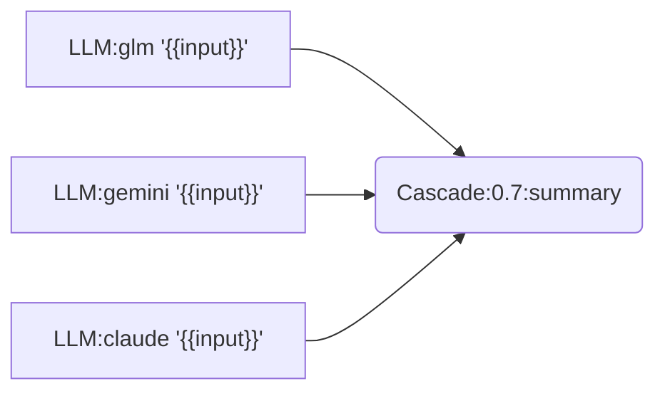

# llm-mcp

OCaml 기반 MCP 서버. 여러 LLM CLI를 MCP 도구로 호출하고, **Chain Engine**으로 복잡한 LLM 파이프라인을 구성할 수 있습니다.

> 개인 환경 기준 설계. 공개 서비스 용도로는 권장하지 않습니다.
>
> 이 프로젝트의 코드는 AI 에이전트(Claude, Gemini, Codex)가 작성했습니다.

## 주요 기능

| 기능 | 설명 |
|------|------|
| Multi-LLM 호출 | Gemini, Claude, Codex, Ollama, GLM을 MCP 도구로 통합 |
| Chain Engine | Mermaid/JSON DSL로 LLM 파이프라인 정의 (27 node types) |
| Consensus 패턴 | 3-LLM 합의 (Quorum) 기반 의사결정 |
| Cascade 라우팅 | 비용/품질 최적화 - confidence 기반 모델 에스컬레이션 |
| 프리셋 | 코드 리뷰, 리서치, 장애 대응 등 사전 정의된 체인 |
| 체크포인트 | 장기 실행 체인의 상태 저장/재개 |

## 아키텍처

```
┌─────────────────────────────────────────────────────────────┐
│                     llm-mcp Server                          │
├─────────────────────────────────────────────────────────────┤
│  MCP Protocol Layer (JSON-RPC 2.0 + SSE)                    │
├─────────────────────────────────────────────────────────────┤
│  ┌─────────────┐  ┌─────────────┐  ┌─────────────────────┐  │
│  │ LLM Tools   │  │ Chain Engine│  │ Prompt Registry     │  │
│  │ gemini      │  │ Mermaid DSL │  │ Version Control     │  │
│  │ claude-cli  │  │ JSON DSL    │  │ Usage Metrics       │  │
│  │ codex       │  │ Presets     │  └─────────────────────┘  │
│  │ ollama      │  │ Checkpoint  │                           │
│  └─────────────┘  └─────────────┘                           │
├─────────────────────────────────────────────────────────────┤
│  Eio Runtime (Fiber-based Concurrency)                      │
└─────────────────────────────────────────────────────────────┘
```

## 사전 요구사항

| 항목 | 버전 | 비고 |
|------|------|------|
| OCaml | >= 5.1 | `opam switch create 5.1.0` |
| dune | >= 3.13 | 빌드 시스템 |
| Gemini CLI | latest | `gemini` 도구용 |
| Claude CLI | latest | `claude-cli` 도구용 |
| Codex CLI | latest | `codex` 도구용 |
| Ollama | latest | `ollama` 도구용 (로컬 모델) |

외부 CLI가 없으면 해당 LLM 도구 호출 시 에러를 반환합니다.

## 빠른 시작

```bash
opam pin add mcp_protocol https://github.com/jeong-sik/mcp-protocol-sdk.git -y
opam pin add grpc-direct https://github.com/jeong-sik/grpc-direct.git -y
opam install . --deps-only
dune build
dune exec llm-mcp -- --port 8932
```

## MCP 설정

`~/.mcp.json` 예시:

```json
{
  "mcpServers": {
    "llm-mcp": {
      "type": "http",
      "url": "http://127.0.0.1:8932/mcp"
    }
  }
}
```

stdio 모드:

```json
{
  "mcpServers": {
    "llm-mcp": {
      "command": "llm-mcp",
      "args": ["--stdio"]
    }
  }
}
```

## Chain Engine 예시

### Consensus 패턴 (3-LLM 합의)


### Cascade 라우팅 (비용 최적화)



저렴한 모델부터 시도하고, confidence < 0.7이면 다음 모델로 에스컬레이션.

### 실행

```bash
curl -X POST http://localhost:8932/mcp -H "Content-Type: application/json" -d '{
  "jsonrpc": "2.0", "id": 1,
  "method": "tools/call",
  "params": {
    "name": "chain.run",
    "arguments": {
      "mermaid": "graph LR\n  a[\"LLM:gemini '\''Hello'\''\"]",
      "input": {}
    }
  }
}'
```

## 프리셋

27개의 체인 프리셋이 `data/chains/`에 정의되어 있습니다. `chain.orchestrate`로 실행합니다.

### 코드 리뷰/품질

| ID | 설명 |
|----|------|
| `consensus-review` | 3-LLM (Codex, Claude, Gemini) 합의 기반 코드 리뷰 |
| `consensus-review-inline` | 인라인 코드 스니펫 합의 리뷰 |
| `pr-review-pipeline` | PR 자동 리뷰 (diff 분석, 커버리지, 보안 스캔) |
| `mcts-mantra-review` | MCTS + MANTRA 리팩토링 리뷰 |
| `mcts-mantra-explore` | MCTS 다관점 이슈 탐색 |
| `mcts-mantra-hybrid` | Explore → Prioritize → Fix 순차 수행 |

### 테스트/커버리지

| ID | 설명 |
|----|------|
| `coverage-generator` | LLM 분석 + anti_fake 품질 게이트 기반 테스트 생성 |
| `coverage-generator-batch` | Fanout + MASC 연동 병렬 커버리지 생성 |
| `walph-coverage` | 목표 커버리지 도달까지 반복 개선 루프 |

### 리서치/분석

| ID | 설명 |
|----|------|
| `deep-research` | 멀티소스 리서치 + 팩트체크 + 종합 |
| `code-migration` | 코드 분석 → 마이그레이션 계획 → 변환 → 등가성 검증 |
| `incident-response` | 로그 분석 → 근본 원인 → 런북 매칭 → 커뮤니케이션 초안 |

### Figma/디자인

| ID | 설명 |
|----|------|
| `figma-to-web-component-v2` | FeedbackLoop로 SSIM 0.95+ 달성까지 코드 반복 개선 |
| `figma-to-web-component` | Vision-First Figma → React+Tailwind (SSIM 0.95+ 검증) |
| `figma-to-prototype` | Figma → iOS/Android/Web 프로토타입 코드 생성 |
| `figma-to-component-spec` | Figma summary → 컴포넌트 스펙(JSON) 생성 |
| `figma-extract-deterministic` | LLM 없이 Figma 노드 DSL만 추출 (depth=2 고정) |
| `figma-visual-regression` | Semantic 검증 → SSIM 비주얼 검증 (2단계 게이트) |
| `design_to_tasks` | 디자인에서 구현 태스크 추출 (실험적) |

### 비용 최적화/워크플로우

| ID | 설명 |
|----|------|
| `cascade-default` | GLM → Gemini → Claude 3-tier cascade (신뢰도 기반 승격) |
| `mermaid-to-chain` | Mermaid 다이어그램 → Chain JSON 변환 |
| `walph-docs` | 문서 생성 + 품질 피드백 루프 |
| `walph-refactor` | 리팩토링 + 품질 피드백 루프 |
| `walph-figma` | Figma → 코드 + 시각적 충실도 피드백 루프 |

### 내부/테스트용

| ID | 설명 |
|----|------|
| `simple-test` | E2E 실행 검증용 최소 체인 |
| `sonnet-test` | Sonnet 단독 실행 테스트 |
| `test-feedback-ollama` | Ollama 피드백 루프 테스트 (실험적) |

```bash
# 프리셋 실행
curl -X POST http://localhost:8932/mcp -d '{
  "jsonrpc": "2.0", "id": 1,
  "method": "tools/call",
  "params": {
    "name": "chain.orchestrate",
    "arguments": {"chain_id": "consensus-review", "input": {"file": "main.ts"}}
  }
}'
```

## 제공 도구

### LLM 도구
- `gemini`: Gemini CLI 호출
- `claude-cli`: Claude Code CLI 호출
- `codex`: Codex CLI 호출
- `ollama`: 로컬 Ollama 호출

### Chain 도구
- `chain.run`: 체인 실행 (Mermaid/JSON)
- `chain.orchestrate`: 프리셋 실행
- `chain.validate`: 체인 문법 검증
- `chain.list`: 등록된 체인 목록
- `chain.to_mermaid`: JSON 체인을 Mermaid로 변환
- `chain.convert`: 체인 포맷 변환
- `chain.visualize`: 체인 구조 시각화
- `chain.checkpoints`: 체크포인트 목록
- `chain.resume`: 체크포인트에서 재개

### Prompt 도구
- `prompt.register`: 프롬프트 템플릿 등록
- `prompt.list`: 등록된 프롬프트 목록
- `prompt.get`: 프롬프트 조회 (버전 지정 가능)

### 유틸리티 도구
- `glm`: GLM 모델 호출
- `glm.ocr`: GLM OCR 레이아웃 파싱
- `glm.image`: GLM 이미지 생성
- `glm.video`: GLM 비디오 생성 태스크
- `glm.stt`: GLM 음성 인식(STT)
- `glm.translate`: GLM 번역
- `gh_pr_diff`: GitHub PR diff 조회
- `slack_post`: Slack 메시지 전송
- `ollama_list`: Ollama 모델 목록
- `gemini_list`: Gemini 모델 목록
- `set_stream_delta` / `get_stream_delta`: 스트림 델타 설정/조회

상세 인자는 `CLAUDE.md` 또는 `docs/`를 참고하세요.

## API 엔드포인트

| Endpoint | Method | 설명 |
|----------|--------|------|
| `/mcp` | POST | JSON-RPC 요청 |
| `/mcp` | GET | SSE 알림 스트림 |
| `/health` | GET | 서버 상태 |
| `/dashboard` | GET | 체인 실행 시각화 |
| `/chain/events` | GET | 체인 실행 이벤트 (SSE) |

## 문서

| 문서 | 내용 |
|------|------|
| CLAUDE.md | Chain DSL 전체 문법, 노드 타입, 패턴 예제 |
| docs/PRESETS.md | 프리셋 상세 + Mermaid 다이어그램 |
| docs/SETUP.md | 설치/실행/연동 |
| docs/OBSERVABILITY.md | 메트릭, 알림 임계값 |
| docs/CHAIN_DSL.md | Chain DSL 스펙 |
| docs/PROTOCOL.md | 프로토콜 상세 |

## 환경변수

| 변수 | 기본값 | 설명 |
|------|--------|------|
| `LLM_MCP_BUDGET_MODE` | false | 절약 모드 (저렴한 모델 우선) |
| `LLM_MCP_MAX_BODY_BYTES` | 20MB | 요청 바디 최대 크기 |
| `LLM_MCP_CORS_MODE` | permissive | CORS 모드 (restrict로 제한 가능) |
| `LLM_MCP_TOOL_CALLS_SERIAL` | false | 도구 순차 실행 |
| `LLM_MCP_MAX_TOOL_CALLS_PER_TURN` | 16 | 턴당 도구 호출 상한 (0=무제한) |
| `LLM_MCP_REQUIRE_SESSION` | false | 세션 필수 모드 |
| `MASC_AGENT_NAME` | chain-engine | MASC 연동 시 에이전트 이름 |

상세 설정은 `docs/SETUP.md` 참고.
