# Chain Examples

Real-world chain examples demonstrating the Chain Engine's DAG execution capabilities.

## Available Chains

| Chain | Description | Est. Time | Est. Cost |
|-------|-------------|-----------|-----------|
| [magi-code-review](#magi-code-review) | 3-LLM consensus code review | 120s | $0.15 |
| [deep-research](#deep-research) | Multi-source research with fact-checking | 180s | $0.25 |
| [pr-review-pipeline](#pr-review-pipeline) | Automated PR review | 90s | $0.12 |
| [incident-response](#incident-response) | Automated incident triage | 120s | $0.18 |
| [code-migration](#code-migration) | Code transformation with verification | 180s | $0.25 |
| [mermaid-to-chain](#mermaid-to-chain) | Convert Mermaid diagrams to Chain JSON | 60s | $0.10 |
| [figma-to-component-spec](#figma-to-component-spec) | Figma summary → component spec JSON | 30s | $0.02 |
| [vision-first-topnode-scout](#vision-first-topnode-scout) | Vision-First 상위 프레임 후보 선정 | 60s | $0.02 |

---

## Realworld-200 Pack

200 chain presets combining MASC + LLM + Figma (prefix: `rw-`).

- Index: `data/chains/realworld-200/index.json`
- Usage notes: `data/chains/realworld-200/README.md`

---

## MAGI Code Review

3-LLM consensus code review using MELCHIOR (Codex), BALTHASAR (Claude), CASPER (Gemini).

```mermaid
graph TD
    A[read-target] --> B[melchior-review<br/>🔬 Codex<br/>bugs/perf/security]
    A --> C[balthasar-review<br/>👩 Claude<br/>clarity/maintainability]
    A --> D[casper-review<br/>🎯 Gemini<br/>architecture/scalability]
    B --> E[consensus-merge<br/>📊 Gemini]
    C --> E
    D --> E

    style B fill:#e1f5fe
    style C fill:#fff3e0
    style D fill:#e8f5e9
    style E fill:#fce4ec
```



**Usage:**
```bash
chain.orchestrate magi-code-review file_path=src/main.ts
```

---

## Deep Research

Multi-source research pipeline with fact-checking and synthesis.

```mermaid
graph TD
    A[query-expansion<br/>🧠 Gemini] --> B[web-search<br/>🔍 Fanout]
    B --> C[extract-facts<br/>📝 Claude]
    C --> D[fact-check<br/>✓ Codex]
    C --> F[generate-citations<br/>📚 Gemini]
    D --> E[synthesize<br/>📄 Gemini]
    E --> G[final-assembly<br/>📋 Claude]
    F --> G

    style A fill:#e8f5e9
    style B fill:#fff9c4
    style C fill:#fff3e0
    style D fill:#e1f5fe
    style E fill:#e8f5e9
    style F fill:#e8f5e9
    style G fill:#fff3e0
```



**Usage:**
```bash
chain.orchestrate deep-research query="What are the latest advances in AI agents?"
```

---

## PR Review Pipeline

Automated PR review: diff analysis, test coverage, security scan, documentation check.

```mermaid
graph TD
    A[fetch-pr-diff] --> C[analyze-complexity<br/>📊 Gemini]
    B[fetch-pr-files] --> C
    A --> D[check-test-coverage<br/>🧪 Claude]
    B --> D
    A --> E[security-scan<br/>🔒 Codex]
    A --> F[doc-check<br/>📝 Gemini]
    B --> F
    C --> G[synthesize-review<br/>📋 Claude]
    D --> G
    E --> G
    F --> G

    style A fill:#e3f2fd
    style B fill:#e3f2fd
    style C fill:#e8f5e9
    style D fill:#fff3e0
    style E fill:#e1f5fe
    style F fill:#e8f5e9
    style G fill:#fff3e0
```



**Usage:**
```bash
chain.orchestrate pr-review-pipeline repo=owner/repo pr_number=123
```

---

## Figma → Component Spec (JSON)

Figma summary를 기반으로 컴포넌트 스펙(JSON)을 생성합니다. 실패 시 fallback JSON을 반환합니다.


**Usage:**
```bash
chain.run figma-to-component-spec url="https://www.figma.com/design/...?...node-id=2089-10737"
```

---

## Vision-First Top-Node Scout

상위 노드를 빠르게 추려서 Vision-First 구현 대상으로 좁히는 1단계 체인입니다.

**Usage:**
```bash
chain.run vision-first-topnode-scout figma_url="https://www.figma.com/design/...?...node-id=2089-10737" keywords="to-be,초대" min_width=600 min_height=400 max_candidates=6
```

## Incident Response

Automated incident triage: log analysis, root cause hypothesis, runbook matching.

```mermaid
graph TD
    A[parse-alert<br/>🚨 Gemini] --> B[fetch-recent-logs]
    A --> C[fetch-metrics]
    A --> D[fetch-recent-deploys]
    A --> H[match-runbook<br/>📖 KB Search]
    B --> E[analyze-logs<br/>🔍 Codex]
    A --> E
    A --> F[correlate-deploys<br/>🚀 Gemini]
    D --> F
    E --> G[generate-hypothesis<br/>🧠 Claude]
    C --> G
    F --> G
    A --> G
    G --> I[draft-communication<br/>✉️ Gemini]
    A --> I
    G --> J[assemble-response<br/>📋 Claude]
    H --> J
    I --> J

    style A fill:#ffcdd2
    style E fill:#e1f5fe
    style F fill:#e8f5e9
    style G fill:#fff3e0
    style I fill:#e8f5e9
    style J fill:#fff3e0
```



**Usage:**
```bash
chain.orchestrate incident-response alert_text="[P1] API latency spike on payment-service..."
```

---

## Code Migration

Automated code migration: analyze, transform, verify equivalence.


**Usage:**
```bash
chain.orchestrate code-migration source_code="..." source_lang=Python target_lang=TypeScript
```

---

## Mermaid to Chain

Convert Mermaid graph diagrams to executable Chain JSON definitions. **Visual Programming for Multi-LLM workflows!**

```mermaid
graph TD
    A[parse-mermaid<br/>🔬 Codex<br/>Extract structure] --> B[infer-node-types<br/>🎯 Gemini<br/>LLM vs Tool]
    A --> C[build-dependencies<br/>🎯 Gemini<br/>Execution order]
    B --> D[generate-chain-json<br/>👩 Claude<br/>Final schema]
    C --> D
    D --> E[validate-chain<br/>🔬 Codex<br/>Circular deps check]
    E --> F[final-output<br/>🎯 Gemini<br/>Fix & output]
    D --> F

    style A fill:#e1f5fe
    style B fill:#e8f5e9
    style C fill:#e8f5e9
    style D fill:#fff3e0
    style E fill:#e1f5fe
    style F fill:#e8f5e9
```



**Usage:**
```bash
chain.orchestrate mermaid-to-chain mermaid="graph TD
    A[fetch-data] --> B[analyze<br/>🔬 Codex]
    A --> C[summarize<br/>👩 Claude]
    B --> D[merge]
    C --> D"
```

**Input**: Any Mermaid `graph TD` or `graph LR` diagram with node hints (🔬=Codex, 👩=Claude, 🎯=Gemini, 🔍=Tool).

**Output**: Valid Chain JSON ready for execution.

---

## Architecture Patterns

### 1. **Parallel Analysis (Fan-out/Fan-in)**
Multiple LLMs analyze the same input in parallel, then merge results.
```
Input → [LLM-A, LLM-B, LLM-C] → Merge → Output
```

### 2. **Sequential Pipeline**
Each stage builds on the previous one.
```
Input → Stage1 → Stage2 → Stage3 → Output
```

### 3. **Tool-LLM Interleaving**
Alternate between tool calls (data fetching) and LLM analysis.
```
Tool → LLM → Tool → LLM → Output
```

### 4. **Consensus Pattern**
Multiple LLMs provide independent reviews, then a coordinator synthesizes.
```
        ┌─ LLM-A ─┐
Input ──┼─ LLM-B ─┼── Coordinator ── Output
        └─ LLM-C ─┘
```

---

## Running Chains

### Via MCP Tool
```json
{
  "tool": "chain.orchestrate",
  "args": {
    "chain_id": "magi-code-review",
    "input": {
      "file_path": "src/main.ts"
    }
  }
}
```

### Via OCaml API
```ocaml
let open Chain_engine in
let chain = load_chain "magi-code-review" in
let input = `Assoc [("file_path", `String "src/main.ts")] in
let result = execute ~sw ~clock ~env chain input in
print_endline (Yojson.Safe.pretty_to_string result)
```

---

## Category Theory Integration

These chains leverage the Chain Engine's Category Theory abstractions:

- **Functor**: Map transformations across node outputs
- **Monad**: Sequential composition with dependency injection
- **Monoid**: Aggregate token usage and stats across parallel branches

See `lib/chain_category.ml` for implementation details.
