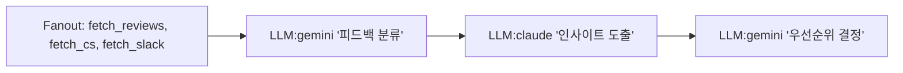

# Chain DSL + n8n 통합 가이드

## 개요

Chain DSL은 AI 워크플로우를 정의하는 **프로토콜**입니다. JSON과 Mermaid 형식 간 **무손실 변환(Lossless Roundtrip)**을 지원하여, 다양한 도구에서 동일한 워크플로우를 편집하고 실행할 수 있습니다.

## 아키텍처

```
┌─────────────────────────────────────────────────────────────┐
│                   Chain DSL Protocol                         │
│                                                              │
│   ┌──────────┐         Lossless         ┌──────────┐       │
│   │   JSON   │ ◄──────────────────────► │ Mermaid  │       │
│   │ 기계친화적│         Roundtrip        │ 시각화용  │       │
│   └──────────┘                          └──────────┘       │
└─────────────────────────────────────────────────────────────┘
        │                                        │
        ▼                                        ▼
┌───────────────┐  ┌───────────────┐  ┌───────────────┐
│     n8n       │  │   VS Code     │  │  Confluence   │
│ Visual Editor │  │  Code Editor  │  │ Documentation │
└───────────────┘  └───────────────┘  └───────────────┘
        │
        ▼
┌─────────────────────────────────────────────────────────────┐
│                    AI 실행 엔진                              │
│   ┌─────────┐  ┌─────────┐  ┌─────────┐                    │
│   │ Gemini  │  │ Claude  │  │  Codex  │  (병렬 실행 가능)   │
│   └─────────┘  └─────────┘  └─────────┘                    │
│                      │                                      │
│                      ▼                                      │
│              ┌─────────────┐                                │
│              │  합의 검증   │  다수결로 품질 보장            │
│              └─────────────┘                                │
└─────────────────────────────────────────────────────────────┘
```

## Mermaid 다이어그램 링크

### 1. Protocol Flow (프로토콜 흐름)

![Protocol Flow](https://mermaid.ink/img/Z3JhcGggVEIKICAgIHN1YmdyYXBoIFByb3RvY29sWyJDaGFpbiBEU0wgUHJvdG9jb2wiXQogICAgICAgIEpTT05bIvCfk4QgSlNPTjxici8+6riw6rOEIOy5nO2ZlOyggSJdCiAgICAgICAgTWVybWFpZFsi8J+TiiBNZXJtYWlkPGJyLz7si5zqsIHtmZQg7Lmc7ZmU7KCBIl0KICAgICAgICBKU09OIDwtLT58Ikxvc3NsZXNzPGJyLz5Sb3VuZHRyaXAifCBNZXJtYWlkCiAgICBlbmQKICAgIAogICAgc3ViZ3JhcGggVG9vbHNbIuuPhOq1rCDsl7Drj5kiXQogICAgICAgIG44blsi8J+UpyBuOG48YnIvPlZpc3VhbCBFZGl0b3IiXQogICAgICAgIFZTQ29kZVsi8J+SuyBWUyBDb2RlPGJyLz5Db2RlIEVkaXRvciJdCiAgICAgICAgRG9jc1si8J+TnSBDb25mbHVlbmNlPGJyLz5Eb2N1bWVudGF0aW9uIl0KICAgIGVuZAogICAgCiAgICBzdWJncmFwaCBFbmdpbmVbIkFJIOyLpO2WiSDsl5Tsp4QiXQogICAgICAgIExMTVsi8J+kliBMTE0gRW5naW5lPGJyLz5HZW1pbmkgLyBDbGF1ZGUgLyBDb2RleCJdCiAgICAgICAgQ29uc2Vuc3VzWyLinIUg7ZWp7J2YPGJyLz7ri6TsiJjqsrAg6rKA7KadIl0KICAgICAgICBMTE0gLS0+IENvbnNlbnN1cwogICAgZW5kCiAgICAKICAgIG44biAtLT58Ik1DUCBBUEkifCBKU09OCiAgICBWU0NvZGUgLS0+fCLsp4HsoJEg7Y647KeRInwgSlNPTgogICAgTWVybWFpZCAtLT58IuusuOyEnCDsgr3snoUifCBEb2NzCiAgICBKU09OIC0tPnwi7Iuk7ZaJInwgTExNCiAgICBDb25zZW5zdXMgLS0+fCLqsrDqs7wifCBuOG4K)

[Mermaid Live Editor에서 편집](https://mermaid.live/edit)

### 2. Use Case: 피드백 분석


## Chain DSL 예시

### 피드백 분석 워크플로우

```json
{
  "id": "feedback_analysis",
  "nodes": [
    {
      "id": "collect",
      "type": "fanout",
      "branches": [
        { "type": "tool", "name": "fetch_app_reviews" },
        { "type": "tool", "name": "fetch_cs_tickets" },
        { "type": "tool", "name": "fetch_slack_feedback" }
      ]
    },
    {
      "id": "classify",
      "type": "llm",
      "model": "gemini",
      "prompt": "다음 피드백을 카테고리별로 분류하세요:\n{{collect.output}}",
      "input_mapping": [["data", "collect"]]
    },
    {
      "id": "analyze",
      "type": "llm",
      "model": "claude",
      "prompt": "분류된 피드백에서 핵심 인사이트를 도출하세요:\n{{classify.output}}",
      "input_mapping": [["classified", "classify"]]
    },
    {
      "id": "prioritize",
      "type": "llm",
      "model": "gemini",
      "prompt": "인사이트를 중요도와 긴급도 기준으로 우선순위를 매기세요:\n{{analyze.output}}",
      "input_mapping": [["insights", "analyze"]]
    }
  ],
  "output": "prioritize",
  "config": {
    "timeout": 300,
    "trace": true,
    "max_depth": 2
  }
}
```

### 동일한 워크플로우 - Mermaid 형식



## n8n 연동 방법

### 1. n8n에서 Chain 호출 (MCP Client Tool)

```
n8n Workflow:
┌──────────────┐    ┌─────────────────┐    ┌──────────────┐
│ Schedule     │ -> │ MCP Client Tool │ -> │ Slack Post   │
│ (매일 09:00) │    │ chain.run       │    │ 결과 공유    │
└──────────────┘    └─────────────────┘    └──────────────┘
```

**MCP Client Tool 설정:**
- Endpoint: `http://llm-mcp:8932/mcp`
- Method: `tools/call`
- Tool: `chain.run`
- Arguments: Chain JSON

### 2. Chain에서 n8n 호출 (Webhook)

```json
{
  "id": "with_n8n_webhook",
  "nodes": [
    { "id": "analyze", "type": "llm", "model": "gemini", "prompt": "분석: {{input}}" },
    {
      "id": "n8n_process",
      "type": "webhook",
      "url": "https://n8n.company.com/webhook/process",
      "method": "POST",
      "body": "{{analyze.output}}"
    },
    { "id": "summary", "type": "llm", "model": "claude",
      "prompt": "n8n 처리 결과 요약: {{n8n_process.output}}" }
  ],
  "output": "summary"
}
```

## 전사 도입 유즈케이스

### 기획 (PM)
| 유즈케이스 | Chain 역할 | n8n 역할 |
|-----------|-----------|---------|
| User Feedback 클러스터링 | 분류/분석/우선순위 | 데이터 수집, 결과 배포 |
| PRD 초안 작성 | 문서 생성 | 트리거, Confluence 연동 |
| 기술검토 및 공수산정 | 분석/산정 | JIRA 연동 |

### 개발 (Engineering)
| 유즈케이스 | Chain 역할 | n8n 역할 |
|-----------|-----------|---------|
| 서버 모니터링 | 로그 분석, 원인 추론 | 알림 트리거, Slack 연동 |
| DB 자연어 쿼리 | 쿼리 생성/실행 | 결과 전달 |
| 기술 부채 리스트업 | 코드 분석 | 스케줄, 리포트 |

### QA
| 유즈케이스 | Chain 역할 | n8n 역할 |
|-----------|-----------|---------|
| 테스트 케이스 작성 | 시나리오 생성 | 기획서 입력, 결과 저장 |
| 이슈 등급 분류 | 분석/분류 | JIRA 연동 |

### 디자인
| 유즈케이스 | Chain 역할 | n8n 역할 |
|-----------|-----------|---------|
| 피그마 일관성 검수 | 분석/검증 | Figma API 연동 |
| 다국어 레이아웃 검증 | 시뮬레이션 | 결과 리포트 |

## 핵심 가치

1. **JSON ↔ Mermaid 무손실 변환**: 개발자는 JSON, 비개발자는 Mermaid로 동일한 워크플로우 관리
2. **n8n 시각적 편집**: 드래그앤드롭으로 AI 워크플로우 구성
3. **다중 LLM 지원**: Gemini, Claude, Codex 등 병렬 실행 및 합의
4. **확장성**: 400+ n8n 통합과 결합

## 다음 단계

1. [ ] llm-mcp SSE 엔드포인트 추가 (n8n MCP Client 연결용)
2. [ ] n8n Custom Node 개발 (llm-mcp 전용)
3. [ ] 파일럿 워크플로우 3개 구축
4. [ ] 전사 교육 및 롤아웃
