```mermaid
graph LR
    A[Tool:fetch_pair] --> F[[First:summarize]]
    F --> Out["(요약, 원본)"]
```

# Chain DSL Specification v2.0

> **목적**: llm-mcp Chain Engine의 타입 시스템, 조합 규칙, 실행 의미론 정의
> **대상**: Visual Editor 구현, 컴파일러 검증, 사용자 문서

---

## 1. 설계 철학

### 1.1 Category Theory 기반

Chain DSL은 카테고리 이론의 원칙을 따릅니다:

```
"제약이 자유를 준다" (Constraints Liberate)
- 엄밀한 법칙 → 예측 가능한 조합
- 명시적 타입 → 컴파일 타임 검증
- 항등원 존재 → 엣지케이스 자동 처리
```

### 1.2 3계층 구조

```
┌─────────────────────────────────────────────────────────────┐
│  🔷 Strict Core          법칙 엄밀, 수학적 보장             │
│     Functor, Monad, Monoid, Product                         │
├─────────────────────────────────────────────────────────────┤
│  🔶 CT-Inspired          영감받음, 법칙 일부 완화           │
│     Alternative, Arrow-like                                  │
├─────────────────────────────────────────────────────────────┤
│  🟢 Practical            실용적 확장, CT 외                 │
│     Quorum, Retry, Race, Threshold, GoalDriven              │
└─────────────────────────────────────────────────────────────┘
```

---

## 2. 타입 시스템

### 2.1 Edge Types (연결선 타입)

```ocaml
type edge_type =
  | Single of content_type     (* 단일 값 *)
  | Multi of content_type      (* 다중 값 리스트 *)
  | Optional of content_type   (* 있거나 없거나 *)

type content_type =
  | Text                       (* 문자열 *)
  | Json                       (* 구조화된 JSON *)
  | Binary                     (* 바이너리 데이터 *)
```

### 2.2 노드 시그니처

모든 노드는 명시적 입출력 타입을 가집니다:

| 노드 | 시그니처 | 설명 |
|------|----------|------|
| **Llm** | `Single<Text> → Single<Text>` | 텍스트 변환 |
| **Tool** | `Single<Json> → Single<Json>` | 도구 호출 |
| **Fanout** | `Single<A> → Multi<A>` | 분기 |
| **Merge** | `Multi<A> → Single<A>` | 병합 |
| **Quorum** | `Multi<A> → Single<A>` | 합의 |
| **Gate** | `Single<A> → Single<A>` | 조건 분기 |
| **Map** | `F<A> → F<B>` | 구조 보존 변환 |
| **Bind** | `A → M<B>` | 동적 라우팅 |
| **Fallback** | `Multi<A> → Single<A>` | 실패 시 대안 |

### 2.3 카디널리티 규칙

| 노드 | 최소 입력 | 최대 입력 | 출력 개수 |
|------|-----------|-----------|-----------|
| **Llm** | 0 | 1 | 1 |
| **Tool** | 0 | 1 | 1 |
| **Fanout** | 1 | 1 | N (자식 수) |
| **Merge** | 2 | ∞ | 1 |
| **Quorum:N** | N | ∞ | 1 |
| **Gate** | 1 | 1 | 1 |
| **Map** | 1 | 1 | 1 |
| **Bind** | 1 | 1 | 1 |
| **Fallback** | 2 | ∞ | 1 |
| **Retry** | 1 | 1 | 1 |

### 2.4 조합 규칙 매트릭스

```
         │ To:                                              │
         │ Llm  Tool  Merge Quorum Gate  Map  Fanout       │
─────────┼─────────────────────────────────────────────────┤
From:    │                                                  │
Single   │  ✅   ✅    ⚠️¹   ⚠️²   ✅    ✅    ✅          │
Multi    │  ❌   ❌    ✅    ✅    ❌    ❌    ❌          │
─────────┴─────────────────────────────────────────────────┘

⚠️¹ Merge: 최소 2개 입력 필요
⚠️² Quorum:N: 최소 N개 입력 필요
```

**컴파일 에러 예시:**


---

## 3. 노드 상세 (Strict Core)

### 3.1 🔷 Functor: Map

출력을 변환합니다. 구조는 보존됩니다.

**법칙:**
```
map id = id                      -- 항등 보존
map (f ∘ g) = map f ∘ map g      -- 합성 보존
```

**문법:**
```
[[Map:함수명]]
```

**예시:**
```mermaid
graph LR
    A[LLM:sonnet "분석"] --> M[[Map:uppercase]]
    M --> B[LLM:haiku "{{M}}"]
```

**내장 함수:**
| 함수 | 설명 |
|------|------|
| `uppercase` | 대문자 변환 |
| `lowercase` | 소문자 변환 |
| `trim` | 공백 제거 |
| `json_extract:path` | JSON 필드 추출 |
| `regex_extract:pattern` | 정규식 추출 |

---

### 3.2 🔷 Monad: Bind

결과에 따라 다음 체인을 동적으로 결정합니다.

**법칙:**
```
return a >>= f  =  f a           -- 좌항등
m >>= return    =  m             -- 우항등
(m >>= f) >>= g =  m >>= (λx → f x >>= g)  -- 결합
```

**문법:**
```
[[Bind:라우터함수]]
```

**예시:**
```mermaid
graph LR
    A[LLM:sonnet "분류: 버그/기능/질문"] --> B[[Bind:route_by_type]]
    %% route_by_type이 "버그"면 bug_chain, "기능"이면 feature_chain 실행
```

---

### 3.3 🔷 Monoid: Merge

여러 결과를 하나로 결합합니다.

**법칙:**
```
empty <> x = x                   -- 좌항등
x <> empty = x                   -- 우항등
(x <> y) <> z = x <> (y <> z)    -- 결합
```

**문법:**
```
{Merge:전략}
```

**전략과 항등원:**
| 전략 | 연산 | 항등원 (empty) |
|------|------|----------------|
| `concat` | 문자열 연결 | `""` |
| `json` | JSON 배열 | `[]` |
| `first` | 첫 번째 선택 | `None` → 다음으로 |
| `last` | 마지막 선택 | `None` → 다음으로 |

**예시:**
```mermaid
graph LR
    A[LLM:sonnet "장점"] --> M{Merge:concat}
    B[LLM:sonnet "단점"] --> M
    M --> C[LLM:haiku "종합: {{M}}"]
```

---

### 3.4 🔷 Product: Fanout

하나의 입력을 여러 노드로 분기합니다.

**법칙:**
```
(f &&& g) x = (f x, g x)         -- 쌍 생성
fst ∘ (f &&& g) = f              -- 첫째 사영
snd ∘ (f &&& g) = g              -- 둘째 사영
```

**문법:** (암묵적 - 같은 노드에서 여러 화살표)
```mermaid
graph LR
    A[LLM:sonnet "주제"] --> B[LLM:sonnet "장점"]
    A --> C[LLM:sonnet "단점"]
```

---

## 4. 노드 상세 (CT-Inspired)

### 4.1 🔶 Alternative: Fallback

실패 시 대안을 시도합니다.

**영감:** Alternative typeclass의 `<|>`

**법칙 (완화됨):**
```
empty <|> x ≈ x                  -- empty는 항상 실패
x <|> y: x 실패시 y 시도
```

**문법:**
```
{Fallback}
```

**예시:**
```mermaid
graph LR
    A[LLM:gemini "질문"] --> F{Fallback}
    B[LLM:ollama "질문"] --> F
    F --> Out[결과]
```

---

### 4.2 🔶 Arrow-like: First, Second

쌍 데이터의 일부만 처리합니다.

**영감:** Arrow typeclass의 `first`, `second`

**문법:**
```
[[First:노드]]   -- 첫 번째만 처리, 두 번째 통과
[[Second:노드]]  -- 두 번째만 처리, 첫 번째 통과
```

**예시:**


---

## 5. 노드 상세 (Practical)

### 5.1 🟢 Quorum (합의)

N개 이상 동의해야 통과합니다.

**문법:**
```
{Quorum:N}
```

**예시:**
```mermaid
graph LR
    A[LLM:sonnet "1+1=?"] --> V{Quorum:2}
    B[LLM:haiku "1+1=?"] --> V
    C[LLM:gemini "1+1=?"] --> V
```

---

### 5.2 🟢 Retry (재시도)

실패 시 지정 횟수만큼 재시도합니다.

**문법:**
```
[[Retry:횟수,백오프ms]]
```

**예시:**
```mermaid
graph LR
    A[LLM:gemini "질문"] --> R[[Retry:3,1000]]
    R --> Out
```

---

### 5.3 🟢 Race (경쟁)

가장 빨리 완료된 결과를 선택합니다.

**문법:**
```
{Race}
```

**예시:**
```mermaid
graph LR
    A[LLM:gemini "질문"] --> R{Race}
    B[LLM:claude "질문"] --> R
    R --> Out[가장 빠른 응답]
```

---

### 5.4 🟢 Threshold (임계값)

메트릭이 임계값을 만족하면 분기합니다.

**문법:**
```
{Threshold:메트릭>=값}
```

**연산자:** `>`, `>=`, `<`, `<=`, `=`, `!=`

**예시:**
```mermaid
graph LR
    A[LLM:sonnet "분석"] --> T{Threshold:confidence>=0.8}
    T -->|pass| B[LLM:haiku "요약"]
    T -->|fail| C[LLM:sonnet "재분석"]
```

---

### 5.5 🟢 GoalDriven (목표 달성)

목표 달성까지 반복 실행합니다.

**문법:**
```
[[Goal:메트릭>=값,최대반복]]
```

**예시:**
```mermaid
graph LR
    A[LLM:sonnet "테스트 생성"] --> G[[Goal:coverage>=80%,5]]
    G --> Out[커버리지 80% 달성]
```

---

### 5.6 🟢 Evaluator (평가/선택)

후보 중 최적을 선택합니다.

**문법:**
```
{Eval:전략}
```

**전략:** `best`, `worst`, `above:0.8`, `weighted`

**예시:**
```mermaid
graph LR
    A[LLM:sonnet "답변1"] --> E{Eval:best}
    B[LLM:haiku "답변2"] --> E
    C[LLM:gemini "답변3"] --> E
    E --> Out[최고 점수 답변]
```

---

## 6. Mermaid 문법 요약

### 6.1 Shape 규칙

| Shape | 문법 | 노드 타입 |
|-------|------|-----------|
| Rectangle | `[내용]` | Llm, Tool |
| Diamond | `{내용}` | Quorum, Gate, Merge, Fallback, Race, Threshold, Eval |
| Subroutine | `[[내용]]` | ChainRef, Map, Bind, First, Second, Retry, Goal |
| Subgraph | `subgraph ... end` | Subgraph |

### 6.2 노드 ID 접두사

| 접두사 | 자동 타입 |
|--------|-----------|
| `llm_*`, `LLM:*` | Llm |
| `tool_*`, `Tool:*` | Tool |
| `quorum_*`, `Q*` | Quorum |
| `merge_*`, `M*` | Merge |
| `gate_*`, `G*` | Gate |
| `ref_*` | ChainRef |
| `map_*` | Map |
| `bind_*` | Bind |

---

## 7. 모델 라우팅

| 모델명 | 라우팅 | API |
|--------|--------|-----|
| `sonnet`, `haiku`, `haiku-4.5`, `opus`, `opus-4`, `claude` | Claude | Anthropic |
| `gemini` | Gemini | Google |
| `codex`, `gpt-5.2` | Codex | OpenAI |
| `ollama`, `ollama:모델명` | Ollama | Local |
| `stub` | Mock | None (테스트용) |

---

## 8. 컴파일러 검증

### 8.1 컴파일 타임 체크

```ocaml
type validation_error =
  | CardinalityMismatch of { node: string; expected: int; got: int }
  | TypeMismatch of { from_type: edge_type; to_node: string }
  | CycleDetected of string list
  | UnresolvedReference of string
  | InvalidModel of string
```

### 8.2 검증 순서

1. **파싱**: Mermaid → AST
2. **타입 검사**: 카디널리티, 타입 매칭
3. **순환 검사**: DAG 확인
4. **참조 해석**: ChainRef 존재 확인
5. **모델 검증**: 지원 모델 확인

---

## 9. Visual Editor 요구사항

### 9.1 노드 팔레트 (카테고리별)

```
┌─────────────────────────────────────┐
│ 🔷 Strict Core                      │
│   [LLM] [Tool] [Map] [Bind] [Merge] │
├─────────────────────────────────────┤
│ 🔶 CT-Inspired                      │
│   [Fallback] [First] [Second]       │
├─────────────────────────────────────┤
│ 🟢 Practical                        │
│   [Quorum] [Gate] [Retry] [Race]    │
│   [Threshold] [Goal] [Eval]         │
├─────────────────────────────────────┤
│ 📦 Structure                        │
│   [Subgraph] [ChainRef]             │
└─────────────────────────────────────┘
```

### 9.2 연결 시 검증

- [ ] 카디널리티 체크 (Merge에 2개 이상?)
- [ ] 타입 호환성 체크
- [ ] 순환 참조 감지
- [ ] 실시간 에러 표시

### 9.3 변환

- [ ] Flow → Mermaid DSL (완벽 지원)
- [ ] Mermaid DSL → Flow (완벽 지원)
- [ ] Flow → Chain JSON (실행용)

---

## 10. 버전 히스토리

| 버전 | 날짜 | 변경사항 |
|------|------|----------|
| 1.0 | 2026-01-21 | 초기 스펙 |
| 2.0 | 2026-01-21 | 명시적 타입 시스템, 카테고리 이론 기반 재구성 |

---

## 참고 문서

- [Category Theory for Programmers](https://github.com/hmemcpy/milewski-ctfp-pdf) - Bartosz Milewski
- [CHAIN_DSL.md](./CHAIN_DSL.md) - 내부 아키텍처
- [CHAIN_RFC.md](./CHAIN_RFC.md) - 설계 의도
