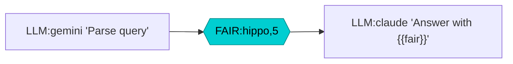
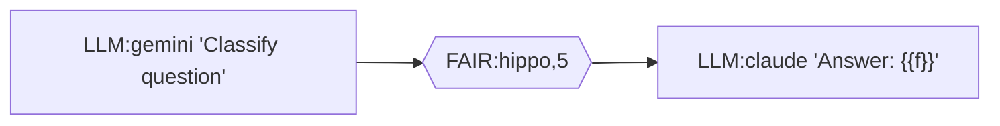
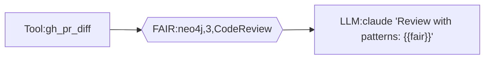
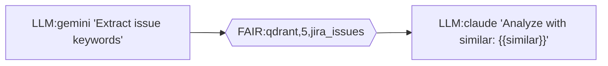
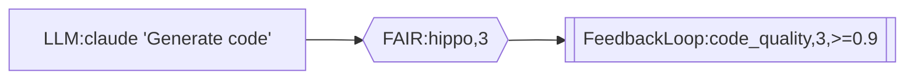

# FAIR Node 설계 (HippoRAG 통합)

## 컨셉

**FAIR** = Findable, Accessible, Interoperable, Reusable
→ 지식 검색 노드 (RAG/HippoRAG 통합)

LLM 체인에서 **컨텍스트를 질의**하는 전용 노드 타입.
기존 Tool 노드로도 가능하지만, FAIR 노드는:
- 검색 결과 자동 포맷팅
- Rerank 내장
- 캐싱 최적화
- 체인 내 컨텍스트 주입 패턴 표준화

---

## Mermaid DSL



### 문법

```
{{"FAIR:source,top_k"}}
{{"FAIR:source,top_k,collection"}}
```

**Examples:**
```
{{"FAIR:hippo,5"}}                    -- HippoRAG, top 5
{{"FAIR:qdrant,10,retrospectives"}}   -- Qdrant 특정 컬렉션
{{"FAIR:neo4j,3,Episode"}}            -- Neo4j 노드 타입
{{"FAIR:multi,5"}}                    -- Multi-layer 통합 검색
```

---

## JSON 구조

```json
{
  "id": "retrieve_context",
  "type": "fair",
  "fair": {
    "source": "hippo",
    "query": "{{input.question}}",
    "top_k": 5,
    "filters": {
      "collection": "retrospectives",
      "date_range": "30d",
      "min_score": 0.7
    },
    "rerank": true,
    "format": "markdown"
  }
}
```

### 필드 설명

| Field | Type | Default | Description |
|-------|------|---------|-------------|
| `source` | string | `"multi"` | 검색 소스 (hippo, qdrant, neo4j, multi) |
| `query` | string | required | 검색 쿼리 (템플릿 변수 지원) |
| `top_k` | int | `5` | 반환할 결과 수 |
| `filters` | object | `{}` | 소스별 필터 옵션 |
| `rerank` | bool | `false` | Self-RAG reranking 활성화 |
| `format` | string | `"json"` | 출력 포맷 (json, markdown, compact) |

---

## 지원 소스

| Source | Backend | Description |
|--------|---------|-------------|
| `hippo` | HippoRAG | DG (벡터) + CA3 (그래프) + CA1 (통합) |
| `qdrant` | Qdrant | 벡터 유사도 검색 |
| `neo4j` | Neo4j | 그래프 패턴 매칭 |
| `multi` | Smart Search | Multi-layer 자동 라우팅 |

### Source별 Filters

**hippo:**
```json
{
  "layers": ["dg_vector", "ca3_graph", "episodic"],
  "community_hop": 2
}
```

**qdrant:**
```json
{
  "collection": "retrospectives",
  "score_threshold": 0.7
}
```

**neo4j:**
```json
{
  "node_label": "Episode",
  "relationship": "MENTIONED_IN",
  "depth": 2
}
```

---

## 사용 패턴

### 1. RAG 기반 Q&A



### 2. 코드 리뷰 컨텍스트



### 3. 이슈 분석 + 유사 이슈



### 4. FeedbackLoop + FAIR (자가 개선)



---

## 구현 고려사항

### OCaml 타입

```ocaml
type fair_source = Hippo | Qdrant | Neo4j | Multi

type fair_config = {
  source: fair_source;
  query: string;
  top_k: int;
  filters: Yojson.Safe.t;
  rerank: bool;
  format: [ `Json | `Markdown | `Compact ];
}

type node_type =
  | ...
  | Fair of fair_config
```

### MCP 통합

FAIR 노드 실행 시 내부적으로:
1. `source`에 따라 적절한 MCP 도구 호출
   - `hippo` → `mcp__hippo__search` (가상)
   - `qdrant` → Qdrant HTTP API
   - `neo4j` → Cypher 쿼리
2. 결과 rerank (옵션)
3. format에 맞게 변환

---

## Mermaid Shape

| Property | Value |
|----------|-------|
| Shape | Hexagon `{{"..."}}` |
| Color | Dark Cyan `#00CED1` |
| Stroke | `#008B8B` |
| classDef | `fair fill:#00CED1,stroke:#008B8B,color:#000` |

육각형 = 지식 허브, 연결의 중심을 상징

---

## 다음 단계

1. [ ] `chain_types.ml`에 `Fair` 노드 타입 추가
2. [ ] `chain_mermaid_parser.ml`에 파싱/생성 로직
3. [ ] `chain_executor_eio.ml`에 실행 로직
4. [ ] HippoRAG MCP 서버 연동
5. [ ] 테스트 케이스 추가

---

*Created: 2026-01-24*
