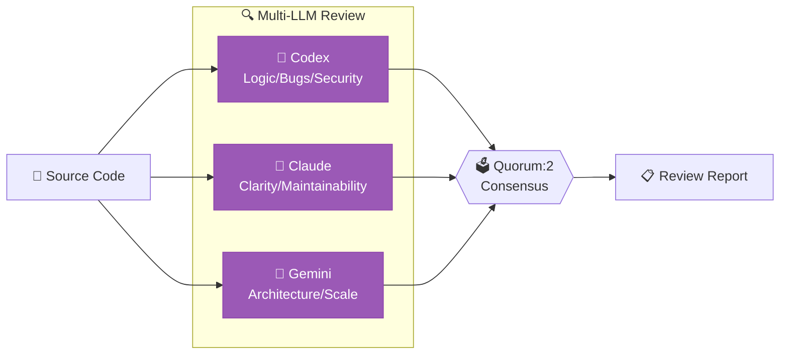
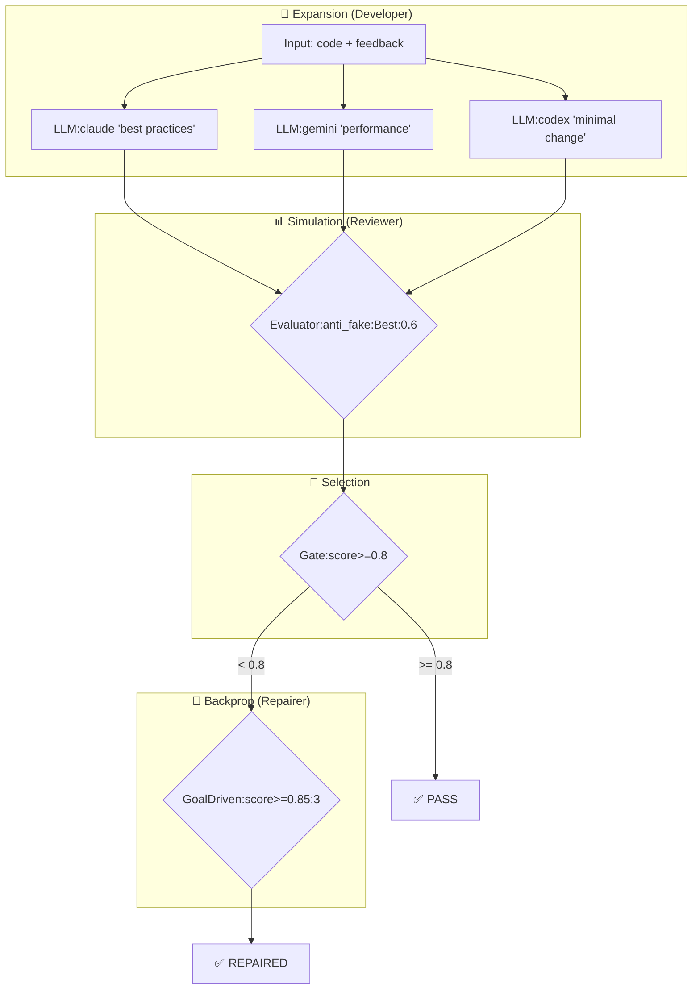
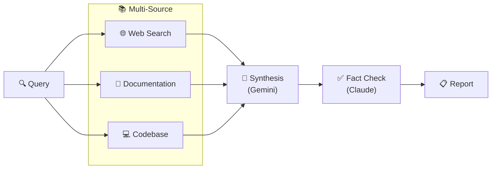
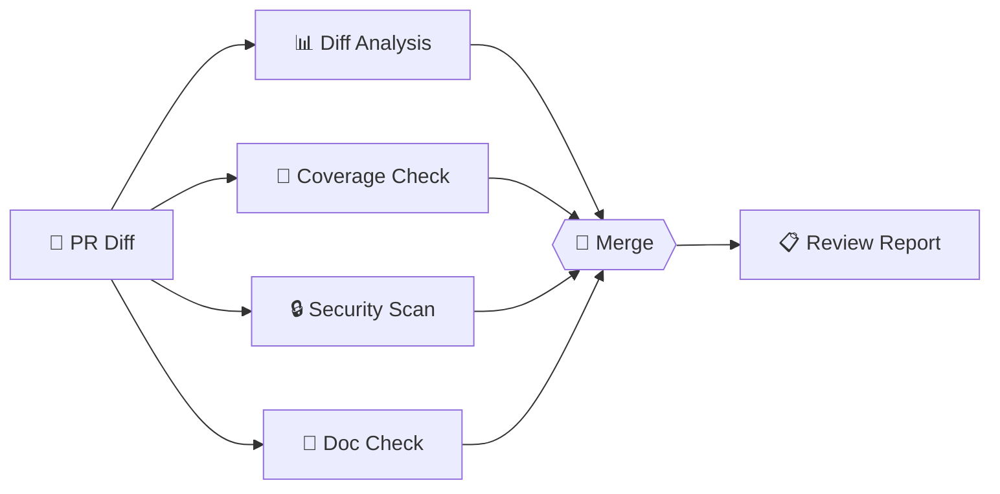
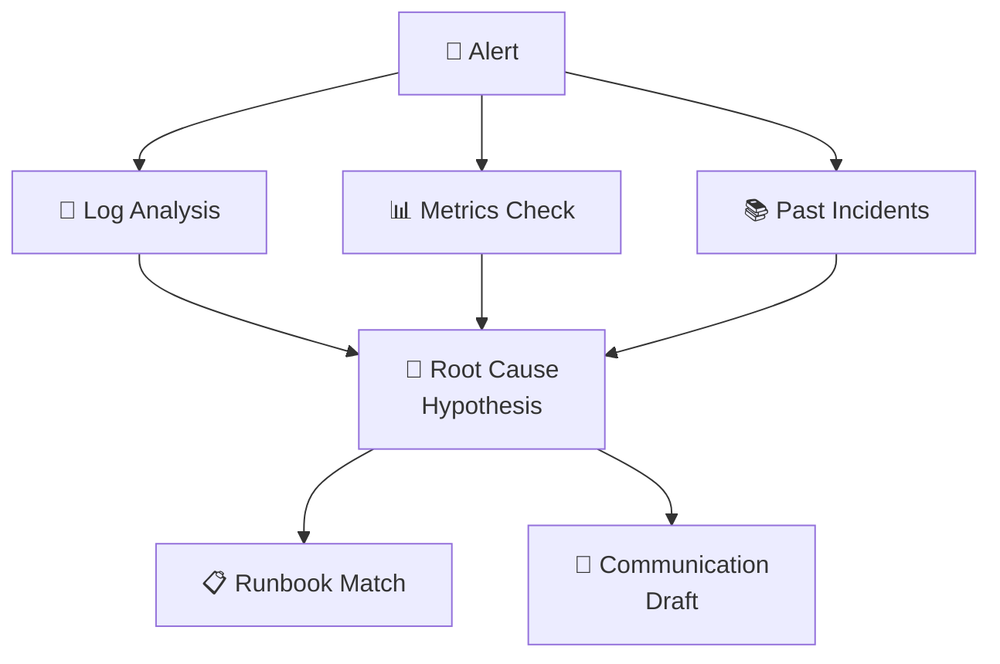
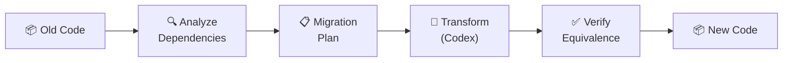
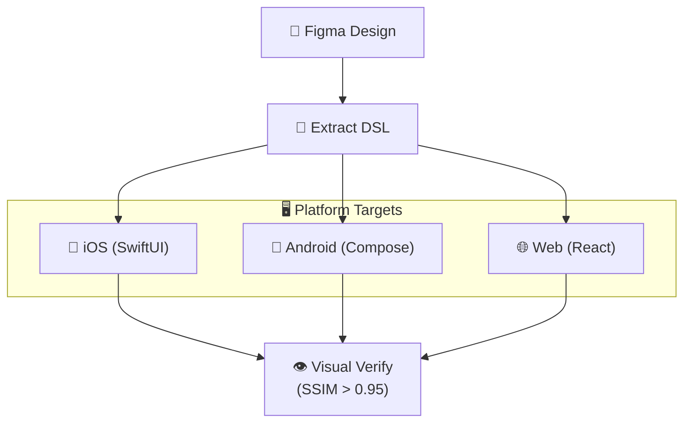
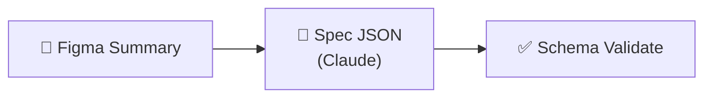
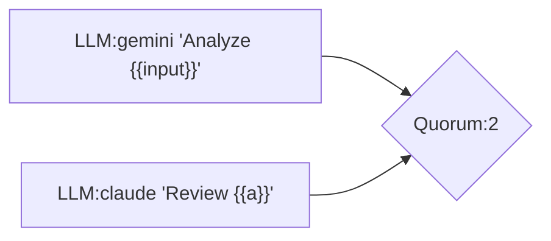

# LLM-MCP Chain Presets Guide

> 언제 어떤 preset을 쓰면 좋을까?

## Quick Reference

| Preset | When to Use | LLMs Used |
|--------|-------------|-----------|
| `consensus-review` | 코드 리뷰가 필요할 때 | Codex + Claude + Gemini |
| `mcts-mantra-review` | 리팩토링 품질 보장이 필요할 때 | 3 LLM + MCTS 탐색 |
| `deep-research` | 깊은 리서치 + 팩트체크 | Gemini + Claude |
| `pr-review-pipeline` | PR 자동 리뷰 | Gemini + Claude |
| `incident-response` | 인시던트 대응 자동화 | Multi-LLM |
| `code-migration` | 코드 마이그레이션 | Codex + Claude |
| `figma-to-prototype` | Figma → 코드 변환 | Gemini + Claude |
| `figma-to-component-spec` | Figma → 컴포넌트 스펙(JSON) | Claude + Gemini |

---

## 1. consensus-review

**🎯 사용 시점**: 중요한 코드 변경에 다각도 리뷰가 필요할 때



**특징**:
- 3개 LLM이 각각 다른 관점으로 분석
- 2/3 합의(Quorum) 기반 결과 도출
- 병렬 실행으로 빠른 처리

---

## 2. mcts-mantra-review ⭐ NEW

**🎯 사용 시점**: 리팩토링 품질을 확실히 보장해야 할 때 (MANTRA 3-agent 패턴)



**MCTS 알고리즘 적용**:
1. **Expansion**: 여러 리팩토링 전략 탐색
2. **Simulation**: anti_fake 평가로 가짜 테스트 필터링
3. **Selection**: UCB1 기반 최적 전략 선택
4. **Backpropagation**: 점수 미달 시 Repairer로 반복 개선

---

## 3. deep-research

**🎯 사용 시점**: 복잡한 주제 리서치 + 팩트체크가 필요할 때



---

## 4. pr-review-pipeline

**🎯 사용 시점**: PR 자동 리뷰 (CI 통합용)



---

## 5. incident-response

**🎯 사용 시점**: 장애 발생 시 초기 대응 자동화



---

## 6. code-migration

**🎯 사용 시점**: 대규모 코드 마이그레이션 (API 변경, 라이브러리 업그레이드)



---

## 7. figma-to-prototype

**🎯 사용 시점**: Figma 디자인 → 코드 자동 변환



---

## 8. figma-to-component-spec

**🎯 사용 시점**: Figma 요약 기반 컴포넌트 스펙(JSON) 생성



---

## Usage Examples

### CLI
```bash
# Consensus 코드 리뷰
curl -X POST http://localhost:8932/mcp -d '{
  "method": "tools/call",
  "params": {
    "name": "chain.orchestrate",
    "arguments": {
      "chain_id": "consensus-review",
      "input": {"file_path": "src/main.ts"}
    }
  }
}'

# MCTS-MANTRA 리뷰
curl -X POST http://localhost:8932/mcp -d '{
  "method": "tools/call",
  "params": {
    "name": "chain.orchestrate",
    "arguments": {
      "chain_id": "mcts-mantra-review",
      "input": {"code": "...", "requirements": "..."}
    }
  }
}'
```

### MCP Tool
```typescript
// Claude Code에서
await mcp.call("chain.orchestrate", {
  chain_id: "consensus-review",
  input: { file_path: "src/feature.ts" }
});
```

---

## Choosing the Right Preset

| Situation | Recommended Preset |
|-----------|-------------------|
| 단순 코드 리뷰 | `consensus-review` |
| 리팩토링 품질 보장 | `mcts-mantra-review` |
| 기술 리서치 | `deep-research` |
| PR 자동화 | `pr-review-pipeline` |
| 장애 대응 | `incident-response` |
| 코드 이전 | `code-migration` |
| 디자인 구현 | `figma-to-prototype` |

---

## Custom Chain Creation

Mermaid로 직접 정의 가능:



```bash
curl -X POST http://localhost:8932/mcp -d '{
  "method": "tools/call",
  "params": {
    "name": "chain.run",
    "arguments": {
      "mermaid": "graph LR\n  a[\"LLM:gemini '\''test'\''\"] --> b[\"LLM:claude '\''review'\''\"]",
      "input": "Hello world"
    }
  }
}'
```
