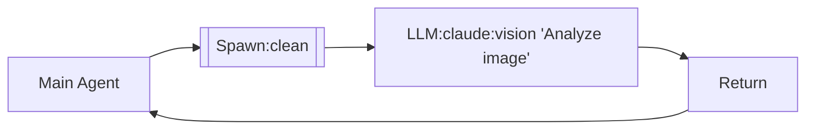

# LLM-MCP Use Cases & Architecture

> Eio 기반 에이전트 시스템의 유즈케이스 다이어그램

Chain DSL 스펙: docs/CHAIN_RFC.md (실용 오케스트레이션 DSL 및 예시).

## Status

| Pattern | 구현 | 테스트 | 모듈 |
|---------|:----:|:------:|------|
| 1. Backend Selection | ✅ | ✅ | `*_backend_eio.ml` |
| 2. Pipeline | ✅ | ✅ | `Presets.Pipeline` |
| 3. Quorum | ✅ | ✅ | `Presets.Quorum` |
| 4. Gate | ✅ | ✅ | `Presets.Gate` |
| 5. Layered | ✅ | ✅ | `Presets.Layered` |
| 6. Diamond | ✅ | ✅ | `Presets.Diamond` |
| 7. Goal-Driven | ✅ | ✅ | `Validation_stack` |
| 8. Clean Context | ✅ | ⬜ | `Spawn` node type |

---

## 1. LLM Backend Selection

```
                    ┌─────────────────────────────────────────┐
                    │           Application Layer              │
                    └──────────────────┬──────────────────────┘
                                       │
                ┌──────────────────────┼──────────────────────┐
                │                      │                      │
                ▼                      ▼                      ▼
       ┌────────────────┐    ┌────────────────┐    ┌────────────────┐
       │ Ollama Backend │    │ OpenAI Backend │    │Claude CLI      │
       │     (Eio)      │    │     (Eio)      │    │Backend (Eio)   │
       └───────┬────────┘    └───────┬────────┘    └───────┬────────┘
               │ HTTP                │ HTTPS               │ Process
               ▼                     ▼                     ▼
       ┌────────────────┐    ┌────────────────┐    ┌────────────────┐
       │  Ollama Server │    │   OpenAI API   │    │  Claude CLI    │
       │  llama3, qwen3 │    │  gpt-4, gpt-4o │    │ sonnet, opus   │
       └────────────────┘    └────────────────┘    └────────────────┘
```

**Use Cases**:
- Ollama: 개발/오프라인/프라이버시
- OpenAI: 프로덕션/고품질
- Claude CLI: Claude Code 통합

**Chain DSL (초안)**:
```json
{
  "chain": {
    "id": "backend_select",
    "nodes": [
      {
        "id": "ollama_gate",
        "type": "gate",
        "condition": "backend == 'ollama'",
        "then": { "id": "ollama", "type": "llm", "model": "ollama", "prompt": "{{input}}" }
      },
      {
        "id": "claude_gate",
        "type": "gate",
        "condition": "backend == 'claude'",
        "then": { "id": "claude", "type": "llm", "model": "claude", "prompt": "{{input}}" }
      }
    ],
    "output": "claude_gate"
  }
}
```

---

## 2. Pipeline (순차 검증)

```
   PR Submitted
        │
        ▼
┌───────────────┐  Pass   ┌───────────────┐  Pass   ┌───────────────┐
│   Syntax      │ ──────▶ │   Type        │ ──────▶ │   Security    │
│   Check       │         │   Safety      │         │   Scan        │
└───────────────┘         └───────────────┘         └───────────────┘
        │ Fail                   │ Fail                   │ Fail
        ▼                        ▼                        ▼
   ┌─────────┐              ┌─────────┐              ┌─────────┐
   │ REJECT  │              │ REJECT  │              │ REJECT  │
   └─────────┘              └─────────┘              └─────────┘
```

```ocaml
let pipeline = Presets.Pipeline.create ~sw [
  (module Syntax_validator);
  (module Type_safety_validator);
  (module Security_validator);
]
```

**Chain DSL (v0.1 예시)**:
```json
{
  "chain": {
    "id": "pipeline_review",
    "nodes": [
      { "id": "syntax", "type": "llm", "model": "gemini", "prompt": "Syntax: {{input}}" },
      { "id": "types", "type": "llm", "model": "claude", "prompt": "Type safety: {{syntax.output}}" },
      { "id": "security", "type": "llm", "model": "codex", "prompt": "Security: {{types.output}}" }
    ],
    "output": "security"
  }
}
```

---

## 3. Quorum (다수결 합의)

```
                         User Query
                              │
               ┌──────────────┼──────────────┐
               ▼              ▼              ▼
        ┌───────────┐  ┌───────────┐  ┌───────────┐
        │  Gemini   │  │  Claude   │  │   GPT-4   │
        │ (CASPER)  │  │(BALTHASAR)│  │(MELCHIOR) │
        └─────┬─────┘  └─────┬─────┘  └─────┬─────┘
              │              │              │
              └──────────────┼──────────────┘
                             ▼
                    ┌─────────────────┐
                    │ Quorum: 2/3     │
                    │ PASS → APPROVED │
                    └─────────────────┘
```

```ocaml
let quorum = Presets.Quorum.create ~sw ~required:2 [
  (module Gemini_validator);
  (module Claude_validator);
  (module GPT4_validator);
]
```

**Chain DSL (v0.1 예시)**:
```json
{
  "chain": {
    "id": "quorum_review",
    "nodes": [
      {
        "id": "vote",
        "type": "quorum",
        "required": 2,
        "nodes": [
          { "id": "g", "type": "llm", "model": "gemini", "prompt": "Review: {{input}}" },
          { "id": "c", "type": "llm", "model": "claude", "prompt": "Review: {{input}}" },
          { "id": "x", "type": "llm", "model": "codex", "prompt": "Review: {{input}}" }
        ]
      }
    ],
    "output": "vote"
  }
}
```

---

## 4. Gate (조건부 실행)

```
                    Request
                       │
                       ▼
              ┌─────────────────┐
              │  Gate Check     │
              │  feature_flag?  │
              └────────┬────────┘
                       │
          ┌────────────┴────────────┐
          ▼ Enabled                 ▼ Disabled
   ┌─────────────┐           ┌─────────────┐
   │  Execute    │           │    Skip     │
   │  Validator  │           │ (Pass-thru) │
   └─────────────┘           └─────────────┘
```

```ocaml
let gated = Presets.Gate.feature_flag
  ~name:"experimental"
  ~flag:"experimental_review"
  (module AI_review_validator)
```

**Chain DSL (v0.1 예시)**:
```json
{
  "chain": {
    "id": "feature_gate",
    "nodes": [
      {
        "id": "gate",
        "type": "gate",
        "condition": "feature_flag('experimental_review')",
        "then": { "id": "review", "type": "llm", "model": "claude", "prompt": "Review: {{input}}" }
      }
    ],
    "output": "gate"
  }
}
```

---

## 5. Layered (Fast → Slow)

```
   Input
     │
     ▼
┌──────────────────────────────────────────┐
│  Layer 1 (< 10ms): Format, Required      │
└────────────────────┬─────────────────────┘
                     │ Pass
                     ▼
┌──────────────────────────────────────────┐
│  Layer 2 (< 100ms): DB, Business Rules   │
└────────────────────┬─────────────────────┘
                     │ Pass
                     ▼
┌──────────────────────────────────────────┐
│  Layer 3 (< 10s): External API, LLM      │
└────────────────────┬─────────────────────┘
                     │ Pass
                     ▼
               ┌───────────┐
               │ VALIDATED │
               └───────────┘

⚡ Early rejection saves expensive computation
```

```ocaml
let layered = Presets.Layered.create ~sw [
  [(module Format); (module Required)];  (* Fast *)
  [(module DB_check); (module Rules)];   (* Medium *)
  [(module External); (module LLM)];     (* Slow *)
]
```

**Chain DSL (v0.1 예시)**:
```json
{
  "chain": {
    "id": "layered_review",
    "nodes": [
      {
        "id": "layered",
        "type": "pipeline",
        "nodes": [
          {
            "id": "fast",
            "type": "fanout",
            "branches": [
              { "id": "format", "type": "llm", "model": "gemini", "prompt": "Format: {{input}}" },
              { "id": "required", "type": "llm", "model": "gemini", "prompt": "Required fields: {{input}}" }
            ]
          },
          {
            "id": "medium",
            "type": "fanout",
            "branches": [
              { "id": "db", "type": "tool", "name": "db-check", "args": {} },
              { "id": "rules", "type": "llm", "model": "claude", "prompt": "Rules: {{input}}" }
            ]
          },
          { "id": "slow", "type": "llm", "model": "codex", "prompt": "LLM deep check: {{input}}" }
        ]
      }
    ],
    "output": "layered"
  }
}
```

---

## 6. Diamond (병렬 → 합류)

```
              Document
                  │
                  ▼
           ┌──────────┐
           │  SPLIT   │
           └────┬─────┘
                │
     ┌──────────┼──────────┐
     ▼          ▼          ▼
┌─────────┐┌─────────┐┌─────────┐
│ Grammar ││ Factual ││  Style  │
│ Score:95││Score:87 ││Score:92 │
└────┬────┘└────┬────┘└────┬────┘
     │          │          │
     └──────────┼──────────┘
                ▼
          ┌──────────┐
          │  MERGE   │
          │ Avg: 91.3│
          └──────────┘
```

```ocaml
let diamond = Presets.Diamond.create ~sw
  ~merge:weighted_average
  [(module Grammar); (module Factual); (module Style)]
```

**Chain DSL (v0.1 예시)**:
```json
{
  "chain": {
    "id": "diamond_review",
    "nodes": [
      {
        "id": "merge",
        "type": "merge",
        "strategy": "weighted_average",
        "nodes": [
          { "id": "grammar", "type": "llm", "model": "gemini", "prompt": "Grammar: {{input}}" },
          { "id": "factual", "type": "llm", "model": "claude", "prompt": "Factual: {{input}}" },
          { "id": "style", "type": "llm", "model": "codex", "prompt": "Style: {{input}}" }
        ]
      }
    ],
    "output": "merge"
  }
}
```

---

## 7. Goal-Driven Loop

```
           ┌─────────────────┐
           │   START GOAL    │
           │ "90% coverage"  │
           └────────┬────────┘
                    │
    ┌───────────────┴───────────────┐
    │                               │
    ▼                               │
┌─────────────┐                     │
│ AGENT LOOP  │◀────────────────────┤
│ 1. Read     │                     │
│ 2. Generate │                     │
│ 3. Execute  │                     │
└──────┬──────┘                     │
       │                            │
       ▼                            │
┌─────────────┐                     │
│  VALIDATOR  │                     │
│ coverage≥90?│                     │
└──────┬──────┘                     │
       │                            │
   Yes │    No                      │
       ▼    ▼                       │
┌──────┐ ┌─────────────┐           │
│ DONE │ │ INTERVENOR  │───────────┘
└──────┘ │ (AI/Human)  │
         └─────────────┘
```

```ocaml
let goal = Validation_stack.Goal.threshold
  ~metric:(module Coverage_metric)
  ~threshold:0.90

let intervenor = Validation_stack.Make_ai_intervenor(struct
  let stall_threshold = 120
  let retry_limit = 5
end)
```

**Chain DSL (주의)**: v0.1 DSL에는 루프 프리미티브가 없다. 외부 루프에서 이 체인을 반복 실행한다.
```json
{
  "chain": {
    "id": "goal_iteration",
    "nodes": [
      { "id": "agent", "type": "llm", "model": "codex", "prompt": "Improve: {{input}}" },
      { "id": "check", "type": "llm", "model": "gemini", "prompt": "Validate goal: {{agent.output}}" }
    ],
    "output": "check"
  }
}
```

---

## Quick Reference

| Pattern | Use Case | 테스트 |
|---------|----------|:------:|
| Pipeline | CI/CD, 순차 검증 | ✅ |
| Fanout | 병렬 처리 | ✅ |
| Quorum | 다수결 (MAGI) | ✅ |
| Gate | Feature Flag | ✅ |
| Layered | Fast→Slow 최적화 | ✅ |
| Diamond | Split→Merge | ✅ |
| Weighted | 가중치 투표 | ✅ |
| Circuit Breaker | 장애 차단 | ✅ |
| Saga | 분산 트랜잭션 | ✅ |
| Checkpoint | 진행 저장/복구 | ✅ |
| **Clean Context** | **Vision/반복 작업** | ⬜ |

---

## 8. Clean Context (컨텍스트 격리)

```
        Main Agent (with context)
                  │
                  │ "analyze this image"
                  ▼
    ┌─────────────────────────────┐
    │   SPAWN CLEAN AGENT         │
    │   (NO prior context)        │
    │                             │
    │   ┌───────────────────┐     │
    │   │   Read(image.png) │     │
    │   │        ↓          │     │
    │   │   Vision Analysis │     │
    │   │        ↓          │     │
    │   │   Pure Output     │     │
    │   └───────────────────┘     │
    │                             │
    └──────────────┬──────────────┘
                   │ uncontaminated result
                   ▼
        Main Agent continues
```

### 문제: 컨텍스트 오염 (Context Contamination)

```
❌ Bad: 이전 세션 HTML이 컨텍스트에 있음
        ↓
   Vision이 이미지를 "읽는" 게 아니라
   컨텍스트에서 텍스트를 "기억"해서 사용

✅ Good: 깨끗한 에이전트가 이미지만 보고 분석
        ↓
   순수하게 시각적 정보만 추출
```

### Use Cases

1. **Vision-First Figma 구현**: 이전 구현 없이 순수하게 디자인 분석
2. **이미지 텍스트 추출**: OCR처럼 정확하게 텍스트 읽기
3. **반복 작업의 독립성**: 각 반복이 이전 결과에 영향받지 않음
4. **A/B 테스트**: 두 에이전트가 동일 조건에서 비교

### Chain DSL (v0.2 제안)

```json
{
  "chain": {
    "id": "clean_context_vision",
    "nodes": [
      {
        "id": "vision",
        "type": "spawn",
        "clean_context": true,
        "node": {
          "id": "analyze",
          "type": "llm",
          "model": "claude",
          "prompt": "이 이미지를 분석해주세요: {{image_path}}",
          "vision": true
        }
      }
    ],
    "output": "vision"
  }
}
```

### Mermaid (제안)



### 핵심 속성

| 속성 | 설명 |
|------|------|
| `clean_context: true` | 이전 대화/파일 컨텍스트 없이 시작 |
| `vision: true` | 멀티모달 이미지 분석 활성화 |
| `inherit_tools: true` | 도구는 상속 (Read, Write 등) |
| `inherit_env: true` | 환경변수는 상속 |

### 구현 고려사항

```ocaml
(* 제안: spawn_clean 함수 *)
let spawn_clean ~sw ~prompt ~image_path =
  (* 새 에이전트 프로세스 시작, 컨텍스트 없이 *)
  let agent = Agent.create ~sw ~context:[] in
  Agent.run agent ~prompt ~attachments:[image_path]
```

### 발견 경위 (2026-01-22)

Figma Vision-First 구현 중 발견:
- 이전 세션의 HTML 파일이 컨텍스트에 로드됨
- "파일에 입력된 정보 기준으로 원생이 즉시 등록됩니다." 텍스트
- 이 텍스트가 Vision 분석에서 나온 건지, 컨텍스트에서 나온 건지 불명확
- **순수 Vision 테스트를 위해 Clean Context 필요성 확인**

---

*llm-mcp v2.1.0*
