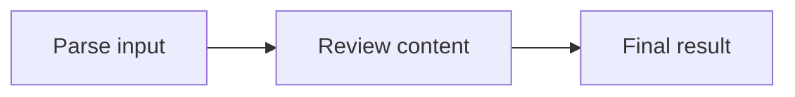
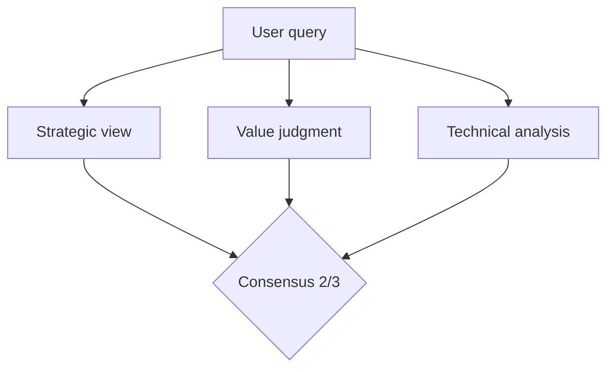
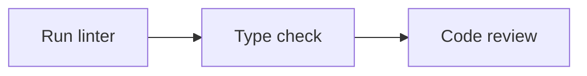
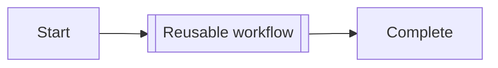
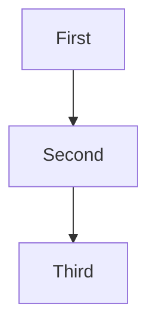
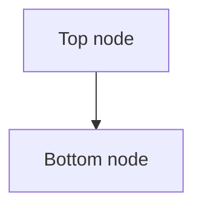

# Mermaid WYSIWYE Syntax Test

WYSIWYE: What You See Is What You Execute

## Test 1: LLM Nodes (Rectangle = Processing)

## Test 2: Quorum Consensus (Diamond = Decision)

## Test 3: Tool Integration

## Test 4: Subroutine/ChainRef (Double bracket = Reference)

## Test 5: Direction Vertical (TB)

## Test 6: Flowchart TD (alias for TB)

